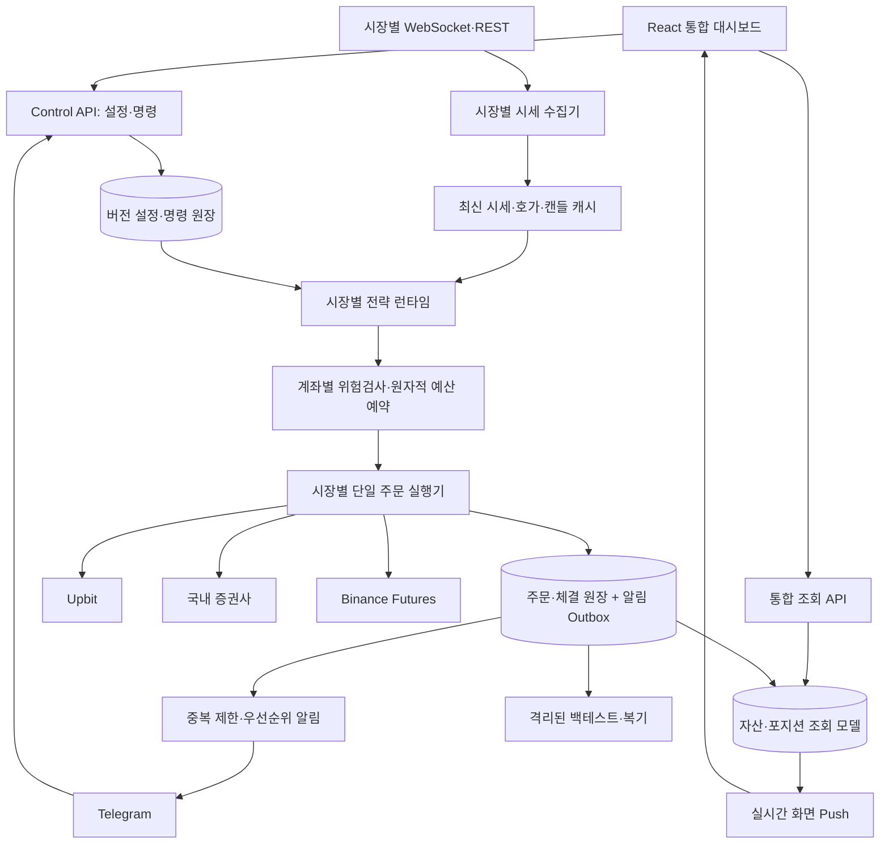

# 사이버펑크 통합 대시보드와 단주기 매매 상세설계

작성일: 2026-09-07
상태: 설계 완료 초안. 운영 코드 및 실계좌 설정 변경 전.
상위 문서: [멀티자산 상세설계](MULTI_ASSET_STOCK_DESIGN.md)

통합 구축안: [서버 이전·뉴런형 대시보드 마스터 설계](MASTER_BUILD_AND_MIGRATION_PLAN.md). 첫 화면은 뉴런형 운영 연결망으로 확장하며 자산 추이·보유표를 함께 제공한다. 배포와 화면 기본 구성은 마스터 설계를 우선한다.

## 1. 결정과 적용 범위

Upbit 현물, 국내주식, Binance 선물을 독립 운영하면서 사이버펑크 스타일의 통합 대시보드를 제공한다. GitHub 공개 UI와 매매 전략의 실제 소스를 참고한다. 짧은 시세 처리 지연과 비용 차감 후 성과를 목표로 하며, 주문 횟수 자체를 목표로 삼지 않는다.

본 문서는 UI, 실시간 경로, 단주기 연구 전략에 관해 상위 설계를 보완한다. 기존 국내주식 퀀트·주도주·삼박자 전략의 보유 주기는 유지하고 단기 전략을 별도 추가한다. 단주기 변경은 기존 포지션에 소급 적용하지 않는다.

## 2. GitHub 화면 사례와 선정

| 사례 | 확인 내용 | 차용 범위 | 결정 |
| --- | --- | --- | --- |
| [nocoo/matrix](https://github.com/nocoo/matrix) | React 기반 사이버펑크 대시보드, 사이드바·헤더·차트 구성 | 화면 뼈대, 촘촘한 정보 배치, 상태 표시 | 주 참고안 |
| [arwes/arwes](https://github.com/arwes/arwes) | 미래형 UI 프레임워크, README에 유지보수 중단 명시 | 얇은 프레임과 모서리 강조 | 시각 참고, 런타임 의존 제외 |
| [alddesign/cyberpunk-css](https://github.com/alddesign/cyberpunk-css) | 순수 CSS 사이버펑크 요소 | 제한적인 각진 버튼·선택 강조 | 보조 참고안 |

Matrix는 거래 엔진이나 검증된 금융 화면이 아니다. 제공하는 예시 데이터·계좌 기능을 실계좌 기능으로 간주하지 않는다. Matrix와 cyberpunk-css의 MIT LICENSE를 확인했다. 실제 파일 차용 시 저작권·라이선스 고지를 보존하고 게임 로고·상표 자산은 별도 사용하지 않는다.

현재는 README·소스 구조 조사 단계다. 실제 실행 화면의 브라우저 검증과 의존성 검사는 구현 단계에 포함한다. 저장소 전체를 그대로 복제하기보다 필요한 UI 컴포넌트를 고정 버전으로 선별한다.

## 3. 시각 규칙

검정 바탕에 청록색 상호작용, 황색 확인 대기, 녹색 정상, 적색 위험, 자홍색 선물 구분을 사용한다. 단색 녹색 화면은 피한다. 숫자는 고정폭 숫자를 사용하고 한글 본문은 읽기 쉬운 산세리프를 사용한다.

| 토큰 | 값 | 용도 |
| --- | --- | --- |
| background | #0B0D10 | 전체 배경 |
| surface | #15191E | 표·도구 영역 |
| border | #424A54 | 영역 구분 |
| text | #E8EDF2 | 본문 |
| secondary | #A8B3BE | 보조 정보 |
| action | #40E6F2 | 선택·저장·탐색 |
| success | #62E59B | 정상·완료 |
| pending | #F1D35C | 승인·확인 대기 |
| danger | #FF6B7A | 실패·위험 |
| futures | #E88CDE | 선물 시장 표식 |

버튼은 동작명을 표시하고 상태 배지는 클릭 가능한 버튼과 구별한다. 생소한 아이콘에는 툴팁을 제공한다. 색상만으로 매수·매도나 성공·실패를 구분하지 않는다. 수익과 손실은 부호를 함께 표시하며 시장별 색상 관습을 섞지 않는다.

모서리는 0~4px, 행 높이 40~44px, 아이콘 터치 영역 최소 44px로 설계한다. 글자 간격은 0이며 본문은 14~16px, 주요 수치는 24~28px로 고정한다. 과도한 네온 번짐, 깜박임, 화면 전체 스캔라인, 시작 애니메이션은 기본 비활성이다. 실제 자산·캔들·체결 그래프가 주 시각 요소다.

## 4. 화면 구조

```text
┌──────────────┬───────────────────────────────────────────────────┐
│ 통합 자산    │ 시장·계좌 | 실/모의 | 운영 단계 | 연결·데이터 시각  │
│ Upbit 현물   ├───────────────────────────────────────────────────┤
│ 국내주식     │ 활성 전략 | 판단 주기 | 주문 한도 | 손실 한도       │
│ Binance 선물 ├───────────────────────────────────────────────────┤
│ 추천·전략    │ 순자산 / 현금 / 실현·미실현 / 비용                 │
│ 주문·체결    │                                                   │
│ 종목·그룹    │ 자산 추이·종목 차트       │ 추천·매매 사유          │
│ 위험관리     ├──────────────────────────┴────────────────────────┤
│ 알림         │ 전체 보유종목·포지션 / 미체결 / 처리 단계          │
│ 설정         ├───────────────────────────────────────────────────┤
│ 사용법·용어  │ 체결·오류 타임라인 / 동기화·주문 처리 지연         │
└──────────────┴───────────────────────────────────────────────────┘
```

데스크톱 사이드바 224px, 나머지 영역은 가변 폭이다. 1100px 이하에서는 보조 영역을 하단으로 이동한다. 768px 이하에서는 사이드바를 메뉴로 접고 상단 파라미터를 줄바꿈한다. 긴 표는 표 영역만 가로 스크롤한다. 화면 크기는 글꼴 축소보다 배치 변경으로 대응한다.

첫 화면은 통합 실시간 자산이다. 상세 사용법과 전략 설명은 독립 탭에 제공하며 해당 설정에서 관련 설명으로 바로 이동할 수 있게 한다. 계좌 연결 전에는 샘플 숫자가 아닌 연결 상태와 필요한 동작을 표시한다.

## 5. 사용자가 클릭·수정하는 기능

| 화면 | 조작 | 저장·적용 결과 |
| --- | --- | --- |
| 통합 자산 | 시장·계좌 선택, 기간 선택, KRW/원통화 전환 | 조회 필터만 변경 |
| 시장 현황 | 보유종목 행 선택 | 해당 거래소·종목 차트와 전략 표시 |
| 추천 | 후보 선택, 사유 펼치기, 승인·거부 | 서버의 요청 ID와 설정 버전 검증 |
| 전략 | 전략 켜기/끄기, 원본/단축 버전 선택 | 신규 진입 대상 버전 변경 |
| 주기 | 1분/3분봉, 판단 간격, 재진입 대기 입력 | 지원 범위와 부하 검사 후 적용 |
| 위험관리 | 주문 금액, 최대 노출, 일손실, 레버리지 상한 | 영향 미리보기와 활성 버전 기록 |
| 종목 | 검색, 선택/제외 체크, 그룹 생성·이름 변경 | 제외 우선 규칙으로 추천·주문 필터 적용 |
| 주문 | 미체결 선택, 취소, 포지션 축소 요청 | 실제 거래소 상태 조회 후 실행 |
| 알림 | 유형 선택, 순서 위/아래 이동, 주기, 묶음 설정 | 미리보기 후 알림 설정 버전 저장 |
| 운영 | 신규 진입 정지/재개 | 보호 감시 상태를 별도로 표시 |
| 이력 | 기간·전략·종목·사유 필터, CSV 다운로드 | 체결 원장 기반 조회 |
| 복기 | 원본/실험 전략 비교, 검증 기간 선택 | 과거 시점에 이용 가능했던 정보로 평가 |
| 설명 | 기능별 설명, 용어 검색 | 계산식·단위·예시·적용 범위 표시 |

상단에는 저장 중인 초안이 아니라 실제 활성 파라미터를 표시한다. 변경사항이 있는 경우 `미적용 변경`을 따로 표시한다. API 오류는 토스트만 띄우지 않고 해당 영역에 오류·마지막 정상 시각을 남긴다.

## 6. 전체 시스템 구조



도식의 OMS와 RISK는 논리 묶음이며 실제로는 시장·계좌별 독립 인스턴스다. 같은 계좌·종목을 기존 봇과 신규 엔진이 동시에 주문하지 않도록 단일 소유권을 둔다. 계좌 예산 예약은 동시 신호에 대해 원자적으로 처리한다.

현재 app.py는 Streamlit 화면에서 Config·Trader·주문 관련 모듈을 직접 가져온다. 신규 React 화면은 조회·명령 API만 사용한다. Python의 기존 시장별 코드는 어댑터 경계부터 점진적으로 옮긴다. 프론트엔드는 React+TypeScript+Vite와 Lucide 아이콘을 후보로 삼고 버전은 구현 시 고정한다.

Hummingbot 원본 Controller를 기준 실험 런타임으로 사용하고, 운영 통합은 검증된 신호를 공통 OrderIntent로 변환하는 방식으로 설계한다. Hummingbot 주문 엔진을 함께 켜서 주문 소유자가 두 개가 되지 않게 한다. 주문 엔진 교체가 필요하면 별도 마이그레이션 범위다.

## 7. 짧은 매매 주기의 의미와 목표

다음 수치는 설계 목표이며 현재 측정 결과나 체결 보장이 아니다. 빠른 처리와 짧은 보유기간은 서로 다른 설정이다.

| 작업 | 초기 목표 | 조건 |
| --- | --- | --- |
| 시세·호가 수신 | 거래소 이벤트 도착 즉시 | WebSocket 사용, 지원 속도 내 처리 |
| 캐시 갱신 | 이벤트 기반 | 종목별 최신 상태 유지 |
| 호가 기반 판단 | 250~500ms 실험 | 선정된 소수 종목, 부하·지연 검증 필요 |
| 캔들 전략 | 1분봉 단축안, 3분봉 원본 | 확정봉 판단이 기본 |
| 보호 감시 | 이벤트 기반 + 1초 로컬 watchdog | 1초마다 REST 주문을 뜻하지 않음 |
| 신규 주문 | 유효한 새 신호 발생 시 | 중복·한도·가격·권한 통과 |
| 동일 종목 재진입 | 30~60초 단축안 비교 | 원본과 별도 버전, 손실 후 대기 우선 |
| 후보 재선정 | 30~60초 | 캐시의 거래대금·유동성 이용 |
| 화면 가격 갱신 | 250~500ms 묶음 | 백엔드 시세 처리와 독립 |
| 잔고·주문 대사 | 이벤트 + 15~30초 REST 보완안 | API 예산에 따라 조절 |
| 일반 알림 요약 | 1/5/15분 선택 | 체결·심각 이벤트는 즉시 큐잉 |

국내주식은 증권사의 실시간 구독 한도와 장시간 확인 후 주기를 확정한다. 장기 전략을 초단타 주기로 강제하지 않는다. 사용자 승인이 필요한 단계에서는 승인까지의 대기시간이 추가되며 만료된 단기 신호는 주문하지 않는다. 빠른 자동 운용은 설정된 범위 안에서만 작동한다.

## 8. 원본 매매 기법 차용

Hummingbot의 Apache-2.0 라이선스와 아래 원본 코드를 확인했다. 이번 작업에서는 외부 코드를 운영 프로젝트에 설치하지 않았다. 구현 시 저장소 commit SHA, 경로, 해시, 의존 지표 버전, LICENSE/NOTICE, 변경점을 manifest에 고정한다. master 링크는 조사 위치이며 재현 가능한 고정 버전은 아직 아니다.

### A. Bollinger V1: 밴드 밖 가격의 되돌림

출처: [원본 Controller](https://github.com/hummingbot/hummingbot/blob/master/controllers/directional_trading/bollinger_v1.py).

원본 기본값은 3분봉, 길이 100, 표준편차 2, BBP 임계값 0과 1이다. BBP가 0 미만이면 롱, 1 초과이면 숏 신호다. 밴드 안으로 돌아온 뒤 진입하는 조건은 원본에 없다. 단축안은 길이와 신호식을 유지하고 1분봉으로 바꾼 별도 버전으로 비교한다.

횡보 구간의 연구 후보다. 추세장에서 반복 역방향 진입이 발생할 수 있으므로 장세 필터 추가 여부는 원본과 분리해 검증한다. Upbit·국내주식에서는 숏 신규 신호를 실행하지 않으며 이를 현물 수정판으로 표시한다.

### B. MACD-BB V1: 밴드 이탈과 모멘텀 변화

출처: [원본 Controller](https://github.com/hummingbot/hummingbot/blob/master/controllers/directional_trading/macd_bb_v1.py).

원본은 3분봉, Bollinger 100/2, MACD 21/42/9다. 롱은 BBP<0, MACD 히스토그램>0, MACD<0을 모두 만족할 때다. 숏은 BBP>1, 히스토그램<0, MACD>0일 때다. 단순 MACD 교차 전략으로 설명하지 않는다. 단축안은 1분봉으로 비교하되 원본 파라미터와 수정 내역을 나란히 표시한다.

### C. PMM Simple: 매수·매도 지정가 유지

출처: [PMM Simple](https://github.com/hummingbot/hummingbot/blob/master/controllers/market_making/pmm_simple.py), [MarketMakingControllerBase](https://github.com/hummingbot/hummingbot/blob/master/hummingbot/strategy_v2/controllers/market_making_controller_base.py).

원본은 중간가격을 기준으로 설정된 매수·매도 간격과 금액을 사용한다. 기본 간격은 각 1%·2%, executor 갱신은 300초다. 이 값은 수초 스캘핑 설정이 아니다. 짧은 갱신 실험은 별도 파생 버전으로 취급한다. 양방향 재고, 취소 중 체결, 수수료를 포함하는 체결 리플레이가 선행되어야 한다.

초기 운영 후보는 A/B의 비교 검증이며 C는 연구 전용이다. 선물 단방향 계좌에서 서로 독립적인 롱·숏 executor를 그대로 실행하지 않는다. 계좌 모드 호환성이 검증되지 않으면 C를 활성화할 수 없다.

### 공통 청산과 원본 차이

[DirectionalTradingControllerBase](https://github.com/hummingbot/hummingbot/blob/master/hummingbot/strategy_v2/controllers/directional_trading_controller_base.py)의 기본값은 손절 3%, 익절 2%, 시간 제한 45분, cooldown 300초, leverage 20, HEDGE다. 반대 신호 발생이 기존 포지션 즉시 청산을 뜻하지 않는다.

원본 재현 실험은 이 설정과 실행 의미를 기록한다. 실제 적용판에서는 기존 선물 설계의 레버리지 상한·계좌 모드·보호주문 계약을 우선한다. 1분봉, 최대 보유 3/5/10분, 재진입 대기 단축은 실험 파라미터다. 이 변경판을 `원본 그대로`라고 표시하지 않는다.

지표 초기화, 진행 중 봉 사용 여부, 수수료, 청산 규칙까지 일치해야 원본 재현으로 인정한다. 원본은 마지막 데이터 행을 사용하므로 진행 봉 포함 여부는 데이터 공급 계약으로 확인한다. 확정봉으로 바꾸면 그 차이도 버전 기록한다.

## 9. 비용과 성과 판정

기본 비용 판정은 다음 구조로 설계한다.

```text
예상 순이익 = 예상 가격차 이익
             - 진입·청산 수수료
             - 예상 슬리피지·스프레드 비용
             - 보유 중 예상 펀딩 지급액
```

실제 bid/ask 체결 시뮬레이션에 포함된 스프레드를 다시 차감하지 않는다. 수수료는 계좌·상품별 조회값을 사용한다. 기대 이익은 과거 검증에서 추정한 값이며 목표 익절률을 그대로 기대값으로 사용하지 않는다. 추정 근거가 없으면 미검증으로 표시한다.

가령 왕복 수수료 0.10%, 기타 비용 0.04%라는 가정에서는 0.10% 가격차 이익이 순손실이다. 이 수치는 설명용이며 특정 거래소의 실제 수수료가 아니다.

원본과 파생 전략을 같은 데이터·비용·자본으로 비교한다. 시간 순서대로 학습/검증/미사용 평가 구간을 나누고 상승·하락·횡보 구간을 포함한다. 승률뿐 아니라 순기대값, 낙폭, 회전율, 체결률, 비용 비중을 본다. 다수 파라미터 중 좋은 결과만 고른 선택 편향을 기록한다.

초 단위 전략은 호가·체결 리플레이, 대기열 가정, 지연·부분체결·취소 체결을 모델링해야 한다. 1분봉만으로 초 단위 체결 성과를 검증했다고 결론 내리지 않는다. 실제 운영 승격에는 계좌 손실예산 안의 낙폭과 비용 스트레스 후 성과를 별도 판정한다.

## 10. 현재 리소스와 지연 예산

현재 머신에서 논리 CPU 8개, 메모리 약 15.7GiB를 확인했다. 사용 가능 메모리·CPU 부하·네트워크 RTT·디스크 성능은 아직 측정하지 않았다. 따라서 초 단위 처리 목표는 용량 시험이 필요하다.

초기 용량 가정은 전체 계약의 가벼운 목록 감시와 시장별 상위 10~20개 상세 감시다. 보유종목과 미체결 종목은 순위와 무관하게 반드시 상세 감시에 포함한다. 이를 수용하지 못하면 신규 후보를 줄이고 보유 감시를 우선한다.

- 주문·체결·위험 이벤트는 보존 큐로 처리하고 임의 폐기하지 않는다.
- 시세 중간 프레임은 최신값으로 합칠 수 있으나 호가 delta는 순서·연속성을 검증한다. 누락 시 스냅샷으로 재동기화한다.
- REST 제한은 계좌/IP/그룹별로 중앙 예산을 두고 기존 프로세스와도 공유 범위를 확인한다.
- 화면·Telegram·복기는 주문 처리 경로를 기다리게 하지 않는다.
- 백테스트는 별도 프로세스에서 동시 작업 1개로 시작하고 실시간 지연이 증가하면 중단한다.
- 신규 다중 워커 운영 원장은 PostgreSQL을 우선안으로 하며, 기존 SQLite/JSON은 읽기·이관 대상으로 둔다.

수집 시각, 로컬 수신, 신호 생성, 위험검사 종료, 주문 전송, 응답, 체결 이벤트 시각을 각각 기록한다. 네트워크 구간과 로컬 처리 구간을 구분한다. 초기 로컬 수신→주문 전송 p95 목표는 500ms 이하이며 승인 대기와 거래소 체결시간은 별도 지표다. 시스템을 HFT급이라고 부르기 위한 근거는 현재 없다.

## 11. 구축 순서와 인수 기준

1. 참조 저장소 commit 고정, 라이선스·의존성 목록, 원본 전략 비교 fixture 확보.
2. 조회 API와 자산 정의 통일, 구형 대시보드와 계좌별 수치 대사.
3. 사이버펑크 React 화면을 읽기 전용으로 구축하고 실제 데이터 연결.
4. 설정·명령 API, Telegram과 UI의 동일 명령 계약 구현.
5. 시세 이벤트 경로와 단주기 실험 런타임 구축.
6. 원본/파생 전략 백테스트 및 모의운영, 지연·부하 측정.
7. 계좌별 단일 주문 소유권을 넘기며 설정 범위 내 운영 적용.

화면 검증은 1440px/1024px/390px에서 Playwright로 수행한다. 사이드바·상단 값·탭·표·모달의 겹침, 키보드 조작, 로딩·빈값·오류·지연 상태를 검사한다. 자산 숫자와 선택 종목이 API 응답 및 원장과 일치해야 한다.

주문 인수 기준은 중복 0건, 취소 중 체결 반영, 보호주문 복구, 재시작 대사, 계좌·환경 혼선 0건이다. 단축안이 비용 후 성과나 데이터 품질 기준을 통과하지 못하면 원본 주기를 유지한다. 디자인 적용이 자동으로 전략·금액·권한 활성화를 유발해서는 안 된다.

## 12. 조사 출처

- [Matrix LICENSE](https://github.com/nocoo/matrix/blob/main/LICENSE)
- [Cyberpunk CSS LICENSE](https://github.com/alddesign/cyberpunk-css/blob/main/LICENSE)
- [Hummingbot LICENSE](https://github.com/hummingbot/hummingbot/blob/master/LICENSE)
- [Hummingbot V2 Controllers](https://hummingbot.org/strategies/v2-strategies/controllers/)
- [Upbit 한국 API 요청 제한](https://docs.upbit.com/kr/reference/rate-limits)
- [Binance 선물 주문 API](https://developers.binance.com/en/docs/catalog/core-trading-derivatives-trading-usd-s-m-futures/api/rest-api/trade)

검증 상태: 공개 소스·문서와 로컬 구조 확인 완료. UI 실제 렌더링, 라이브 지연 측정, 전략 수익 검증, 외부 코드 설치는 미실시.
