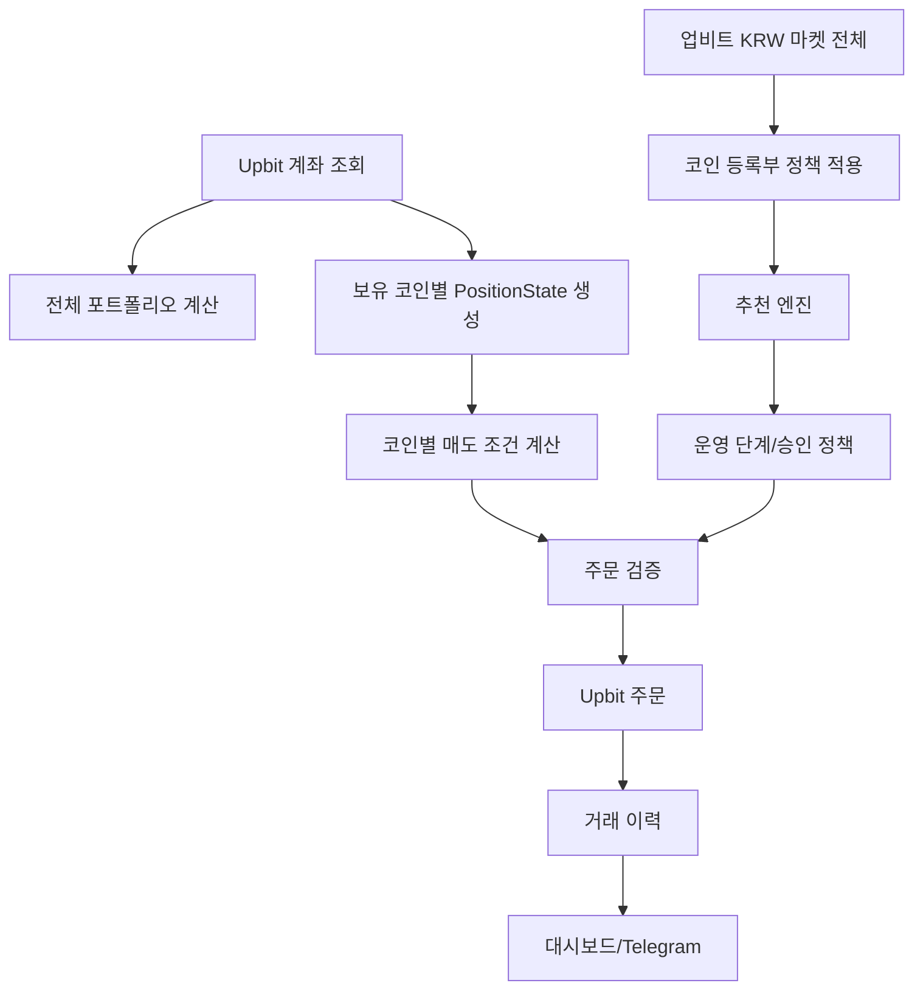

# 대시보드 재설계안

## 1. 핵심 원칙

이 시스템은 비트코인 단일 자동매매가 아니라 업비트 KRW 마켓 전체를 대상으로 하는 포트폴리오 운용 시스템이다.

따라서 대시보드는 다음 세 가지 개념을 분리해서 보여줘야 한다.

1. 포트폴리오: 내 업비트 계좌 전체 자산, 현금, 보유 코인, 평가손익
2. 개별 포지션: 코인별 현재가, 평균매수가, 손익률, 매도 조건
3. 전략/추천: 어떤 코인을 추천했고 왜 매수/매도 판단을 했는지

상단 요약에는 단일 코인의 현재가, 평균매수가, 손익률을 표시하지 않는다. 평균매수가는 반드시 코인별 행 안에서만 표시한다.

## 구현된 화면 골격

- 왼쪽 사이드바: 전체 자산, 보유 코인, 추천 코인, 운영/파라미터, 코인 관리, Telegram 알림, 거래 이력, 전략 진단, 수동 주문, 도움말, 설계 화면으로 이동한다.
- 왼쪽 운영 제어: 실행/재개, 일시정지, 긴급정지, 정지 해제와 자동 새로고침을 제공한다.
- 상단 파라미터 라인: 현재 적용 중인 운영 단계, 거래 성향, 주문 모드, 승인 방식, 1회 매수금액, 자동매수 슬롯, 손절/익절, 유효 추천점수를 모든 화면에서 동일하게 표시한다.
- 실시간 메뉴만 부분 새로고침하고 설정 입력 화면은 자동 새로고침하지 않는다.
- `.env`의 `MARKET`은 전체 자산 대표 마켓이 아니라 별도 `전략 진단 마켓`으로만 표현한다.

## 2. 현재 문제

| 문제 | 원인 | 수정 방향 |
| --- | --- | --- |
| 기준전략 평균매수가가 전체 지표처럼 보임 | 단일 BTC 포지션 필드를 상단 요약에 사용 | 상단에서 제거하고 보유 코인 표에서만 표시 |
| 현재가가 BTC 위주로 보임 | `.env`의 `MARKET` 값을 실시간 현황 대표값처럼 표시 | 상단에는 현재가를 두지 않고, 코인별 현재가 표로 표시 |
| 총 평가금액과 BTC 평가금액이 혼동됨 | `total_equity` 필드가 과거에는 단일 포지션 기준이었음 | 전체 포트폴리오 평가금액을 별도 계산 |
| 보유 수량이 어떤 코인의 수량인지 불명확 | 단일 포지션 수량을 전체 현황에 노출 | 상단은 보유 코인 수, 표는 코인별 보유수량 |
| 자동매수/자동매도/추천의 관계가 불명확 | 화면 탭이 기능 추가 순서대로 쌓임 | 운용 흐름 기준 탭으로 재정렬 |

## 3. 새 첫 화면

첫 화면 이름: `전체 자산`

첫 화면은 토스뱅크 주식 화면처럼 “내 자산이 지금 얼마이고, 어떤 코인이 얼마나 차지하며, 무엇이 손익을 만들었는지”를 먼저 보여준다.

상단 카드:

| 지표 | 정의 |
| --- | --- |
| 총 자산 | KRW + 모든 보유 코인의 KRW 환산 평가금액 |
| 사용 가능 KRW | 업비트 계좌의 주문 가능 원화 |
| 투자 중 금액 | 총 자산 - 사용 가능 KRW |
| 평가손익 | 모든 코인의 평가금액 - 매수원금 합계 |
| 평가손익률 | 평가손익 / 매수원금 |
| 보유 코인 수 | 업비트 계정에 실제 잔액이 있는 코인 수. 환산 불가 자산도 포함 |

KRW 직거래가 없는 자산은 `BTC-코인 × KRW-BTC` 또는 `USDT-코인 × KRW-USDT` 순서로 환산한다. 세 경로가 모두 없으면 보유 목록에는 표시하되 총 자산과 손익에서는 제외하고 `환산 경로 없음`으로 표시한다.

상단에 표시하지 않는 것:

- 현재가
- 평균매수가
- BTC 보유수량
- 단일 마켓 RSI
- 단일 마켓 이동평균

이 값들은 코인별 상세 또는 전략 진단 탭에서만 표시한다.

## 4. 탭 구조

### 1. 전체 자산

목적: 업비트 계좌 전체 현황을 확인한다.

표시:

- 총 자산
- 사용 가능 KRW
- 투자 중 금액
- 평가손익
- 보유 코인 수
- 자산 비중 도넛 차트
- 평가금액 순위
- 손익률 순위
- 최근 매매 이력

### 2. 보유 코인

목적: 코인별 상태와 매도 조건을 확인한다.

표시:

- 마켓
- 보유수량
- 현재가
- 평균매수가
- 평가금액
- 매수원금
- 평가손익
- 손익률
- 자동매매 허용 여부
- 손절 가격
- 1차 익절 가격
- 2차 익절 가격
- 다음 매도 조건
- 마지막 주문 시각

여기서만 평균매수가를 보여준다.

### 3. 추천 코인

목적: 업비트 KRW 마켓 전체에서 어떤 코인이 후보인지 확인한다.

표시:

- 추천 순위
- 추천 점수
- 현재가
- 24시간 거래대금
- RSI
- 추세
- 추천 사유
- 위험 요인
- 자동매매 가능 여부
- Telegram 질문 예시

### 4. 운용 제어

목적: 봇이 어느 수준으로 자동 행동할지 제어한다.

표시:

- 실행/일시정지
- 킬 스위치
- 실거래 여부
- 운영 단계
- 승인 필요 여부
- 하루 최대 신규매수 수
- 자동매매 최대 보유 종목 수(기존 일반 보유자산은 강제 매도하지 않음)
- 코인당 최대 투자금

### 5. 파라미터

목적: 매수, 매도, 추천, 리스크 조건을 설정한다.

구분:

- 매수 조건: 1회 매수 금액, 코인당 최대금액, 추천 점수 기준
- 매도 조건: 손절률, 1차 익절률, 1차 매도 비율, 2차 익절률, 트레일링 스탑
- 추천 필터: 거래대금, 변동률, 스캔 코인 수, BTC 포함 여부
- 리스크: 일일 손실 제한, 최대 거래 횟수, 최대 보유 코인 수

### 6. 코인 관리

목적: 업비트 등록 코인을 감시/추천/자동매매/제외로 분류한다.

표시:

- 감시
- 추천
- Telegram 승인
- 자동매매
- 제외
- 그룹
- 메모

### 7. Telegram / 알림

목적: 어떤 내용을 어떤 순서와 주기로 받을지 설정한다.

표시:

- 알림 유형
- 전송 여부
- 우선순위
- 최소 간격
- Telegram 명령어 예시
- 최근 명령어 로그

### 8. 거래 이력 / 검증

목적: 실제 체결, 실패, 보류, 추천 이력을 검증한다.

표시:

- 매수
- 매도
- 실패
- 보류
- 추천 갱신
- 수수료
- 체결 상태
- 주문 UUID
- 사유

### 9. 전략 진단

목적: 개발자/운영자가 전략 계산을 확인한다.

표시:

- 기준전략 마켓
- 캔들
- 이동평균
- RSI
- 볼린저밴드
- 신호
- 이 탭은 첫 화면에 두지 않는다.

## 5. 데이터 모델 재정의

### PortfolioState

```text
total_value_krw
available_krw
invested_value_krw
total_cost_krw
unrealized_pnl_krw
unrealized_pnl_rate
holding_count
updated_at
```

### PositionState

```text
market
currency
balance
locked
avg_buy_price
current_price
cost_krw
value_krw
pnl_krw
pnl_rate
auto_trade_allowed
stop_loss_price
take_profit_1_price
take_profit_2_price
next_exit_rule
last_order_time
```

### BotState

```text
running_status
real_trade_enabled
operation_mode
approval_required
last_step
last_order_action
last_order_market
last_order_result
last_error
heartbeat
```

단일 마켓 필드인 `last_price`, `avg_buy_price`, `position_volume`은 전체 화면에서 사용하지 않는다.

## 6. 동작 흐름



## 7. 구현 순서

1. 상단 요약에서 단일 마켓 지표 제거
2. `fetch_portfolio` 결과를 기준으로 첫 화면 요약 재작성
3. 보유 코인 탭을 분리하고 코인별 매도 조건 컬럼 추가
4. 전략 진단 탭을 뒤로 이동
5. `runtime_state.json`의 표시 목적 필드를 `portfolio_state.json`과 `bot_state.json`으로 분리
6. 거래 이력에서 매수/매도/실패/보류를 명확히 분리
7. Telegram 알림도 포트폴리오 요약, 추천, 주문, 오류로 분리

## 8. 즉시 제거해야 할 표현

- 기준전략 평균매수가
- 기준전략 손익률
- 화면 현재가
- 마켓
- 보유 수량

대체 표현:

- 전체 평가금액
- 사용 가능 KRW
- 투자 중 금액
- 보유 코인 수
- 코인별 평균매수가
- 코인별 현재가
- 전략 진단 마켓
