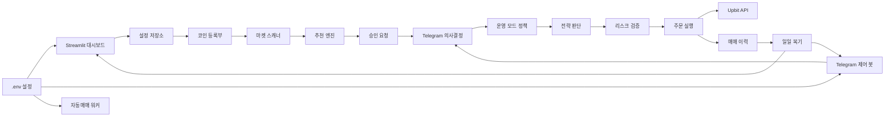
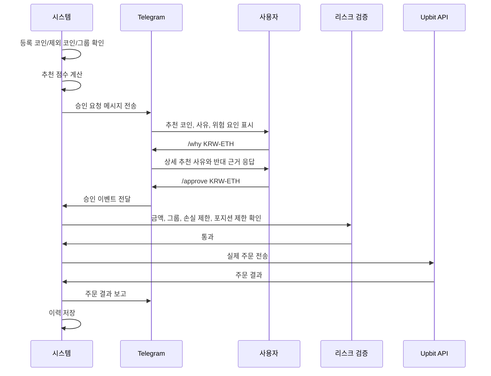

# Upbit Auto Trader 확장 설계서

> 2026-07-19 대시보드 재설계 기준은 `DASHBOARD_REDESIGN.md`를 우선합니다. 핵심 원칙은 BTC 단일 마켓 화면이 아니라 업비트 KRW 마켓 전체 포트폴리오 화면을 첫 화면으로 두는 것입니다. 평균매수가, 현재가, 손익률은 전체 상단 요약이 아니라 코인별 상세에서만 표시합니다.

## 1. 목적

현재 프로젝트는 단일 마켓 중심의 자동매매 구조입니다. 확장 설계의 목표는 업비트에 등록된 여러 KRW 마켓 코인 중에서 거래량, 추세, 변동성, 과거 전략 성과가 좋은 후보를 자동으로 추천하고, 사용자가 Telegram으로 승인한 경우에만 실제 매매를 실행하는 것입니다.

핵심 원칙은 다음과 같습니다.

- 시스템은 후보 코인을 자동으로 찾고 추천합니다.
- 실제 진입은 사용자에게 묻고 승인받은 경우에만 실행합니다.
- 사용자가 설정한 코인, 그룹, 제외 목록, 금액, 리스크 조건 밖에서는 주문하지 않습니다.
- 추천 메시지에는 왜 추천했는지 사유와 위험 요인을 함께 표시합니다.
- 사용자는 Telegram에서 `/why KRW-XXX`로 더 자세한 추천 사유를 물어볼 수 있습니다.
- 모든 추천, 승인, 거절, 주문 결과는 기록하여 일일 복기에 사용합니다.

## 2. 운영 단계

### 1단계: 추천 전용

시스템은 업비트 KRW 마켓을 스캔하고 추천 코인을 보여줍니다. Telegram으로 추천 메시지를 보내지만 실제 주문은 하지 않습니다. 사용자가 승인해도 기록 또는 모의 판단까지만 수행합니다.

권장 상황:

- 초기 검증
- 추천 점수 검토
- 초보자 운영
- 실거래 전 전략 이해

### 2단계: 승인형 실제 추천 매매

시스템이 실제 매매 후보를 찾으면 Telegram으로 승인 요청을 보냅니다. 사용자가 `/approve KRW-XXX`를 입력해야만 설정 범위 안에서 실제 매수를 시도합니다.

이 단계가 기본 권장 운영 단계입니다.

실행 조건:

- 해당 코인이 감시 대상이어야 합니다.
- 제외 목록에 없어야 합니다.
- 그룹 정책이 실제 매매를 허용해야 합니다.
- 예상 주문 금액이 설정 범위 안이어야 합니다.
- 일일 손실 제한, 최대 포지션, 최소 주문 금액을 통과해야 합니다.
- 사용자가 Telegram으로 승인해야 합니다.

### 3단계: 그룹 제한 자동매매

사용자가 허용한 코인 그룹 안에서는 자동 진입을 허용합니다. 고위험 그룹은 여전히 승인형으로 유지할 수 있습니다.

예시:

- 대형 코인 그룹: 제한 자동매매
- 거래량 상위 그룹: Telegram 승인 필요
- 고위험 관찰 그룹: 추천만 표시
- 사용자 제외 그룹: 감시/추천/매매 제외

### 4단계: 완전 자동 운영

추천, 선정, 진입, 청산을 자동으로 수행합니다. 이 단계는 장기간 모의매매와 소액 실거래 검증 후에만 사용하는 것을 권장합니다.

필수 안전장치:

- 킬 스위치
- 일일 손실 제한
- 최대 거래 횟수 제한
- 최대 동시 보유 코인 수 제한
- Telegram 이상 상황 경보
- 일일 복기 리포트

## 3. 전체 시스템 구조



## 4. 추가 모듈 설계

| 모듈 | 예상 파일 | 역할 |
| --- | --- | --- |
| 운영 모드 정책 | `operation_mode.py` | 1~4단계별 추천, 승인, 자동매매 허용 범위를 결정 |
| 코인 등록부 | `coin_registry.py` | 감시 코인, 제외 코인, 그룹, 그룹별 정책 저장 |
| 마켓 스캐너 | `market_scanner.py` | 업비트 KRW 마켓 조회, 후보 필터링 |
| 추천 엔진 | `recommendation_engine.py` | 추천 점수 계산, 추천 사유 생성 |
| Telegram 의사결정 | `telegram_decision.py` | `/approve`, `/reject`, `/why`, `/exclude` 처리 |
| 알림 설정 | `notification_settings.py` | 어떤 항목을 어떤 주기로 보낼지 관리 |
| 백테스터 | `backtester.py` | 과거 데이터로 승률, 수익률, 최대 낙폭 계산 |
| 일일 복기 | `daily_reviewer.py` | 매일 저녁 실제/가상 결과 비교 리포트 생성 |
| 설정 저장소 | `settings_store.py` | 대시보드 설정 JSON 저장/로드 |

## 5. 코인 관리 설계

업비트에 등록된 모든 KRW 마켓을 대상으로 하되, 사용자가 체크박스와 그룹 설정으로 매매 범위를 제한합니다.

### 기본 그룹

| 그룹 | 기본 정책 | 설명 |
| --- | --- | --- |
| 대형 코인 | 승인형 또는 제한 자동매매 | 거래대금과 유동성이 큰 코인 |
| 거래량 상위 | 승인형 매매 | 최근 거래대금과 거래량 증가율이 높은 코인 |
| 고위험 관찰 | 추천만 표시 | 급등락, 스프레드, 과열 위험이 큰 코인 |
| 사용자 제외 | 완전 제외 | 사용자가 직접 제외했거나 시스템이 위험하다고 본 코인 |

### 체크박스 기능

대시보드의 코인 관리 탭에는 다음 체크박스를 둡니다.

- 감시 대상
- 추천 허용
- Telegram 승인 요청 허용
- 자동매매 허용
- 제외

자동매매 허용은 그룹 정책보다 강하게 동작하지 않습니다. 예를 들어 사용자가 코인을 자동매매 허용으로 체크해도, 해당 그룹이 추천 전용이면 실제 주문은 실행하지 않습니다.

## 6. 추천 점수 설계

추천 점수는 단일 조건이 아니라 여러 요소의 합산으로 계산합니다.

| 항목 | 설명 |
| --- | --- |
| 거래대금 점수 | 최근 24시간 거래대금이 충분한지 |
| 거래량 증가 점수 | 최근 거래량이 평균보다 증가했는지 |
| 추세 점수 | 단기/중기/장기 이동평균 배열이 우호적인지 |
| RSI 점수 | 과열 또는 침체 구간인지 |
| 변동성 위험 | 급등락이 지나치게 크지 않은지 |
| 스프레드 위험 | 호가 간격이 너무 크지 않은지 |
| 최근 전략 승률 | 과거 캔들에서 기존 전략이 얼마나 자주 성공했는지 |
| 기대수익 점수 | 승률뿐 아니라 평균 수익과 평균 손실을 반영 |
| 최대 낙폭 위험 | 과거 테스트에서 손실 폭이 과도하지 않은지 |

중요: 승률만으로 추천하지 않습니다. 승률이 높아도 손익비가 나쁘면 추천 점수를 낮춥니다.

## 6-1. 거래 성향 설계

사용자는 대시보드에서 거래 성향을 선택할 수 있습니다.

| 성향 | 목적 | 적용 방식 |
| --- | --- | --- |
| 보수적 | 거래 빈도를 줄이고 안정적인 후보만 선택 | 추천 점수 기준 상향, 거래대금 기준 상향, 허용 등락률 축소, 거래량 조건 강화 |
| 균형 | 기본 전략 조건 유지 | 기존 추천/전략 기준을 그대로 적용 |
| 적극적 | 더 자주 후보를 찾고 빠르게 진입 검토 | 추천 점수 기준 완화, 거래대금 기준 완화, 허용 등락률 확대, 거래량 조건 완화, RSI/급등 차단 기준 완화 |

적극적 성향은 “무조건 매수”가 아닙니다. 실제 주문은 운영 단계, Telegram 승인 필요 여부, 제외 코인, 그룹 정책, 금액 제한, 리스크 검증을 모두 통과해야 합니다.

## 7. 승인형 실제 매매 흐름



## 8. Telegram 명령어 설계

| 명령어 | 예시 | 기능 |
| --- | --- | --- |
| `/status` | `/status` | 현재 봇 상태 확인 |
| `/recommend` | `/recommend` | 추천 코인 TOP N 확인 |
| `/why` | `/why KRW-ETH` | 왜 추천했는지 상세 사유 확인 |
| `/approve` | `/approve KRW-ETH` | 추천 코인 실제 진입 승인 |
| `/reject` | `/reject KRW-ETH 과열이라 보류` | 추천 거절 및 사용자 사유 기록 |
| `/watch` | `/watch KRW-SOL` | 감시 목록에 추가 |
| `/exclude` | `/exclude KRW-DOGE` | 추천/매매 후보에서 제외 |
| `/include` | `/include KRW-DOGE` | 제외 해제 |
| `/group` | `/group KRW-ETH major` | 코인 그룹 지정 |
| `/mode` | `/mode 2` | 운영 단계 변경 |
| `/style` | `/style aggressive` | 거래 성향을 보수적/균형/적극적으로 변경 |
| `/pause` | `/pause` | 자동매매 일시정지 |
| `/kill` | `/kill` | 긴급 차단 |

## 9. Telegram 승인 요청 예시

```text
[매매 승인 요청]

추천 코인: KRW-ETH
추천 순위: 1위
추천 점수: 82/100
현재가: 4,210,000 KRW
24시간 거래대금: 1,240억 KRW
최근 전략 승률: 63.2%
예상 진입금액: 50,000 KRW
손절 기준: -3%
1차 익절: +3%

추천 이유:
- 거래대금이 충분합니다.
- 단기 이동평균이 중기 이동평균 위에 있습니다.
- 거래량이 최근 평균보다 증가했습니다.
- RSI가 과열 구간은 아닙니다.

주의 요인:
- 최근 10분 변동성이 평소보다 큽니다.
- 승인 후에도 리스크 검증을 통과해야 주문됩니다.

더 묻기: /why KRW-ETH
승인: /approve KRW-ETH
거절: /reject KRW-ETH
제외: /exclude KRW-ETH
```

## 10. 대시보드 탭 설계

| 탭 | 목적 |
| --- | --- |
| 실시간 현황 | 현재 봇 상태, 포지션, 손익률, 추천 코인, 마지막 주문 결과 표시 |
| 운영 / 모니터링 | 운영 단계, 승인 대기, 일일 손익, 킬 스위치 관리 |
| 코인 관리 | 업비트 등록 코인을 감시/추천/자동매매/제외로 분류 |
| 추천 코인 | 추천 TOP N, 점수, 사유, 위험 요인 표시 |
| 파라미터 설정 | 금액, 손절, 익절, 추천 필터, 알림 주기 설정 |
| Telegram 설정 | 전송 항목, 주기, 명령어 예시, 승인 정책 설정 |
| 일일 복기 | 오늘의 실제/모의 매매와 과거 데이터 기반 대안 비교 |

각 파라미터에는 초보자용 설명을 붙입니다.

예:

```text
코인당 최대 투자금
- 의미: 한 코인에 최대 얼마까지 투자할지 정합니다.
- 낮게 설정하면 위험은 줄지만 기회도 줄어듭니다.
- 높게 설정하면 수익 기회는 커지지만 손실 위험도 커집니다.
- 초보자 권장값: 총 운용금액의 10~20%
```

## 11. 일일 복기 설계

매일 저녁 설정된 시간에 다음을 수행합니다.

1. 오늘의 추천, 승인, 거절, 주문 이력을 불러옵니다.
2. 실제 또는 모의 매매 결과를 계산합니다.
3. 오늘의 캔들 데이터를 기반으로 대안 파라미터를 백테스트합니다.
4. 승률, 총 수익률, 손익비, 최대 낙폭, 거래 횟수를 비교합니다.
5. 더 좋았을 조건과 왜 그런지 설명합니다.
6. 대시보드와 Telegram으로 리포트를 보냅니다.

승률만 높았던 조건은 좋은 조건으로 보지 않습니다. 총 수익률, 최대 낙폭, 손익비가 함께 개선되어야 추천합니다.

## 12. 저장 파일 설계

| 파일 | 역할 |
| --- | --- |
| `coin_registry.json` | 감시/추천/제외/그룹 설정 |
| `notification_settings.json` | Telegram 알림 항목과 주기 |
| `recommendation_state.json` | 현재 추천 목록, 점수, 추천 사유 |
| `trade_history.jsonl` | 추천, 승인, 거절, 주문 결과 이력 |
| `daily_reviews.json` | 일일 복기 결과 |

초기에는 JSON 파일로 충분합니다. 이력이 많아지면 SQLite로 이전합니다.

## 13. 구현 순서

1. 설계 데이터와 대시보드 설명 반영
2. 설정 저장소 추가
3. 코인 등록부와 체크박스 UI 추가
4. 마켓 스캐너 추가
5. 추천 엔진 추가
6. Telegram `/recommend`, `/why`, `/approve`, `/reject` 추가
7. 승인형 실제 추천 매매 연결
8. 매매 이력 저장
9. 일일 복기 리포트 추가
10. 3단계 그룹 제한 자동매매 검토

## 14. 검증 기준

실제 주문 연결 전 반드시 확인합니다.

- 제외 코인이 추천되지 않는가
- 자동매매 금지 그룹에서 주문이 발생하지 않는가
- 승인 없는 실제 진입이 차단되는가
- 승인 후에도 리스크 검증 실패 시 주문이 차단되는가
- Telegram 승인/거절 사유가 기록되는가
- 추천 사유와 위험 요인이 대시보드와 Telegram에 표시되는가
- 일일 손실 제한이 여러 코인에서도 적용되는가
- 킬 스위치가 모든 신규 주문을 차단하는가

## 15. 결론

이 설계는 현재 프로젝트 구조에 반영 가능합니다. 권장 기본 운영은 2단계인 승인형 실제 추천 매매입니다. 시스템이 추천과 사유 설명을 자동으로 수행하고, 사용자가 Telegram으로 승인한 경우에만 실제 주문을 실행합니다. 비트코인 하나에 한정하지 않고 업비트 등록 KRW 마켓 전체를 대상으로 하되, 체크박스, 제외 목록, 그룹 정책으로 매매 범위를 통제합니다.
