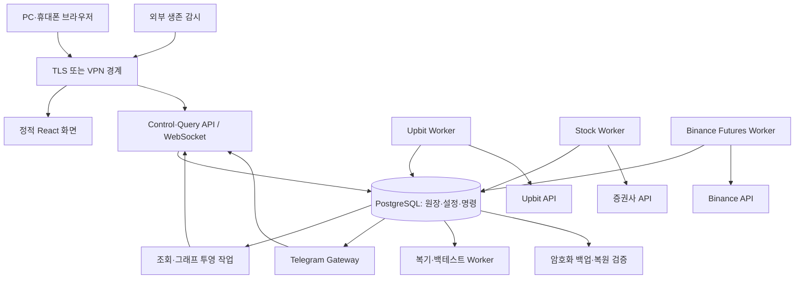

# 통합 구축·서버 이전·뉴런형 대시보드 마스터 설계

작성일: 2026-09-07
상태: 구축 명세. 이 문서의 경로·API·명령은 구현 예정 계약이며 현재 실행 기능이 아니다.

## 1. 문서 관계와 결정

이 문서를 전체 구축의 진입점으로 사용한다. 배포·이전·화면 기본 구성은 본 문서가 우선한다. 상세 주문·선물 계약은 [멀티자산 설계](MULTI_ASSET_STOCK_DESIGN.md), 원본 전략과 단주기 검증은 [사이버펑크·실시간 설계](CYBERPUNK_REALTIME_DESIGN.md)를 따른다. 기존 DESIGN.md와 DASHBOARD_REDESIGN.md는 배경 자료이며 신규 구현 상태의 증거로 사용하지 않는다.

| 영역 | 확정한 설계 방향 |
| --- | --- |
| 거래 영역 | Upbit 현물 / 국내주식 / Binance 선물 독립 실행 |
| 공통 기능 | 로그인·조회·설정·감사·알림·성과 |
| 화면 | 사이버펑크 색상 + 뉴런형 연결 그래프 + 원장 표 |
| 프론트엔드 | React·TypeScript, 정적 빌드 배포 |
| 서버 API | Python FastAPI, 버전 API, WebSocket 화면 스트림 |
| 거래 워커 | 시장·계좌별 Python 프로세스, 계좌당 주문 소유자 1개 |
| 영구 원장 | PostgreSQL, 버전 마이그레이션 |
| 배포 | Docker Compose, 환경별 설정, 고정 이미지 digest |
| 초기 서버 | Linux 단일 호스트, 추후 연구 워커·DB 분리 가능 |
| 전략 | 원본 재현과 단축 실험을 분리, 계좌별 검증 버전 선택 |

현재 확인된 구현은 Streamlit app.py와 Python·JSON/JSONL 기반 Upbit 구성이다. 컨테이너, 신규 API, 뉴런 그래프와 신규 시장 워커는 구축 대상이다. 실제 프로세스의 현재 가동 상태는 이번 설계에서 재검증하지 않았다.

## 2. 배포 구조



API는 거래소 키를 갖지 않는다. 그래프·알림·복기는 주문 판단의 동기 의존성이 아니다. 시세와 호가의 고빈도 처리는 해당 시장 워커 메모리에서 수행하고 모든 틱을 DB 경유시키지 않는다. 초기에는 별도 메시지 브로커 없이 DB 명령함·Outbox와 워커별 메모리 큐로 시작한다.

PostgreSQL 알림은 깨우기 신호일 뿐 전달 보장이 아니다. 워커는 영구 명령 테이블에서 미처리 ID를 다시 조회한다. DB 트랜잭션으로 주문 의도와 예산 예약을 저장하고 외부 주문 후 응답 불명확 상태를 대사한다. DB와 거래소를 하나의 원자 트랜잭션으로 취급하지 않는다.

| 서비스 | 영구 상태 | 외부 연결 | 초기 복제 수 |
| --- | --- | --- | --- |
| web/proxy | 빌드 산출물·TLS 설정 | 브라우저 | 1 |
| api | DB의 설정·명령 | 사용자·Telegram 내부 명령 | 1 |
| upbit-worker | DB + 복구 저널 | Upbit | 계좌당 1 |
| stock-worker | DB + 복구 저널 | 선택 증권사 | 계좌당 1 |
| futures-worker | DB + 복구 저널 | Binance 선물 | 계좌당 1 |
| projector | 재생 가능한 조회 상태 | 없음 | 1 |
| notification | Outbox·전송 상태 | Telegram | 봇당 활성 수신자 1 |
| research | 검증 결과·데이터 파일 | 허용 데이터 공급원 | 동시 작업 1 |
| postgres | 전체 원장·설정 | 내부 네트워크 | 1 |

주문 워커는 단순 replica 증가로 확장하지 않는다. 먼저 계좌·시장 경계로 분리한다. 같은 호스트 장애는 모든 서비스를 멈출 수 있으므로 독립 프로세스를 고가용성으로 표현하지 않는다.

## 3. 뉴런형 사이버펑크 화면

주 참고 스타일은 [Matrix](https://github.com/nocoo/matrix)이며 그래프 후보는 [react-force-graph](https://github.com/vasturiano/react-force-graph)다. 후자는 Canvas 2D와 Three.js 기반 3D, 확대·이동·클릭 기능을 제공한다. 실제 채택 버전과 라이선스 고지는 구현 때 고정한다.

첫 화면은 상단 순자산·손익, 중앙 뉴런형 운영 그래프, 하단 전체 보유자산 표로 구성한다. 기존 자산 추이 차트는 같은 화면의 `자산 추이` 탭에서 접근하며, 그래프 선택 상태가 자산 합계를 임의로 바꾸지 않게 한다.

```text
왼쪽 탐색       상단 실제 설정: 시장/계좌/실·모의/전략/주기/한도
───────────    ────────────────────────────────────────────────
통합 운영      순자산    실현손익    미실현손익    현금·증거금
Upbit 현물     [운영 연결망] [자산 추이] [판단 흐름] [위험 연결]
국내주식       뉴런형 그래프, 계좌와 전략을 중심으로 종목 확장
Binance 선물   선택 노드 상세: 값·시각·근거·원본 이벤트
전략·추천      ────────────────────────────────────────────────
주문·체결      전체 보유종목 표 / 실제 주문·보호 상태
설정·알림      선택 이벤트 타임라인
설명·용어
```

### 노드·연결 의미

| 표현 | 실제 의미 | 클릭 결과 |
| --- | --- | --- |
| 계좌 노드 | 거래소·시장·계좌별 순자산 | 잔고·원통화·평가 시각 |
| 전략 노드 | 실제 활성 전략 버전 | 원본/수정 규칙·파라미터·검증 성과 |
| 종목 노드 | 해당 거래소의 계약 또는 현물 | 시세·보유·추천·제외 사유 |
| 신호 노드 | 특정 시각에 발생한 판단 | 지표값·진입/거부 근거 |
| 주문 노드 | 특정 주문 의도와 상태 | 체결·미체결·보호주문 |
| 계좌→전략 | 배정 예산 | 활성 설정 버전 |
| 전략→신호→종목 | 실제 추천 근거 | 판단 스냅샷 |
| 신호→주문 | 승인·위험검사 통과 후 요청 | 거부 사유 또는 체결 |

뉴런처럼 보이는 점과 연결선은 실제 데이터 관계를 나타낸다. 학습된 신경망의 가중치나 AI가 생각하는 과정을 표시하는 것은 아니다. 화면 명칭은 `운영 연결망`으로 하고 상세 설명에서 이 의미를 명확히 한다.

색은 기존 사이버펑크 토큰을 유지한다. 노드 유형은 모양·아이콘으로, 상태는 색+문구로 구분한다. 기본 크기는 유형별 고정이며 `노출 크기` 모드를 켰을 때만 명시한 금액 척도로 바꾼다. 계좌 순자산과 선물 계약 규모를 같은 척도로 섞지 않는다.

연결선을 따라 움직이는 빛은 실제 신호·체결 이벤트에만 짧게 표시한다. 장식용으로 주문이 발생한 것처럼 점멸하지 않는다. 실패는 붉은 상태 표식, 대기는 황색, 정상 연결은 청록색이며 애니메이션 끄기를 제공한다.

### 사용자 조작과 성능

- 2D/3D 분할 선택, 확대/축소, 화면 맞춤, 배치 고정, 검색, 선택 해제.
- 시장·계좌·전략·보유만·최근 사건 필터와 그룹 접기/펼치기.
- 노드 클릭은 조회다. 주문·승인은 상세 영역의 명시적 버튼에서 수행한다.
- 기준 시각 선택으로 과거 판단 흐름 재생. 과거 화면에서는 운영 명령 비활성.
- 모바일 기본은 2D와 목록이다. WebGL 실패 시 2D, Canvas 실패 시 표로 전환한다.
- 기본 가시 노드 상한 150개, 초과분은 그룹으로 집계한다. 숨겨진 보유·경고 수를 표시한다.
- 상세 확장 시 최대 500개를 실험하되 실제 기기 성능으로 조정한다. 레이아웃은 안정화 후 정지하고 데이터 갱신마다 재시작하지 않는다.
- 3D는 카드에 가두지 않고 본문 주 영역을 사용한다. 서버 GPU는 필요 없으며 브라우저에서 렌더링한다.
- 숫자 갱신 250~500ms, 그래프 구조 갱신 1초 묶음 목표. 거래 워커 속도와 분리한다.
- 모든 노드 정보는 검색 가능한 표에서도 제공한다. 색상·3D 조작만으로 기능 접근을 제한하지 않는다.

위험 연결 탭의 상관관계는 별도 통계 보기다. 상관계수·관측기간·샘플 수를 명시하고 가격 수준 대신 수익률을 사용한다. 상관을 인과나 헤지 보장으로 표현하지 않는다. 상관 데이터가 없으면 계산 전 상태를 표시한다.

## 4. API와 그래프 데이터 계약

| 예정 API | 계약 |
| --- | --- |
| GET /api/v1/portfolio | 계좌 범위·평가통화·기준시각·순자산 정의 |
| GET /api/v1/positions | 거래소·계좌·상품·방향·관리 범위 |
| GET /api/v1/graph | view, account_ids, as_of, node_limit, cursor |
| GET /api/v1/decisions/{id} | 사용 지표·전략 버전·비용·승인·위험검사 |
| POST /api/v1/config-drafts | 초안 저장, 활성 설정과 분리 |
| POST /api/v1/commands | idempotency_key, account, action, config_version, expires_at |
| GET /api/v1/commands/{id} | 접수·실행·확인 중·완료·거부 |
| WS /api/v1/events | scope, stream_epoch, sequence, as_of, 변경 데이터 |

Node는 `id, type, market, account_ref, instrument_id, state, label, metric, metric_unit, as_of, evidence_ids`를 가진다. Edge는 `id, source, target, relation, event_id, as_of`를 가진다. 이벤트·노드 ID에는 LIVE/DEMO와 거래소·계좌 범위를 포함한다. 계좌 별칭만 클라이언트에 전달한다.

인증 범위 밖 계좌는 서버에서 제외한다. 초기 snapshot과 delta의 버전을 맞추고 sequence 누락 또는 서버 epoch 변경 시 snapshot을 다시 가져온다. 그래프는 원장으로 재구성 가능해야 하며 별도 진실 원장이 되지 않는다. 오래된 값은 `지연` 표시하고 현재값으로 간주하지 않는다.

## 5. 코드·설정·데이터 분리

```text
multi-asset-trader/
  apps/dashboard/            React 소스
  services/api/              조회·명령·인증
  services/projector/        자산·그래프 조회 모델
  services/notification/     Telegram
  workers/upbit/             기존 로직 점진 이관
  workers/domestic_stock/
  workers/binance_futures/
  workers/research/
  packages/domain/           공통 계약·정밀 금액
  packages/strategies/       원본·파생 전략과 manifest
  adapters/                  거래소별 API 변환
  migrations/                DB 스키마·이관
  deploy/compose.yaml        공통 서비스 정의
  deploy/compose.dev.yaml    개발 전용 포트·소스 연결
  deploy/compose.server.yaml 서버 제한·영구 경로
  deploy/config.example.env  비밀값 없는 환경 예시
  scripts/                   doctor·backup·restore·reconcile
  tests/                     계약·대사·UI·장애 시험
  docs/                      설계·운영 절차
```

Windows 절대 경로, .bat, 로컬 .venv에 서버 실행을 의존시키지 않는다. 컨테이너 내부 경로는 `/app`, `/data`, `/run/secrets`로 통일한다. 시간은 UTC로 저장하고 화면은 Asia/Seoul로 표시하며 국내주식 장 달력은 별도 유지한다.

서버 영구 영역은 `/srv/multi-asset/{config,secrets,backups,artifacts,journal}`로 제안한다. DB는 명시적 영구 볼륨에 저장한다. 데이터 경로는 환경 설정으로 바꿀 수 있어야 한다.

비밀이 아닌 환경 설정: `APP_ENV`, `INSTANCE_ID`, `DATA_DIR`, `PUBLIC_BASE_URL`, `DISPLAY_TIMEZONE`, `TRADING_ENABLED`, `NOTIFICATION_SEND_ENABLED`.

키·DB 암호는 파일 secret 참조로 주입한다. Compose의 파일 secret 자체가 호스트 파일을 암호화해 주는 것은 아니므로 호스트 권한과 백업 암호화가 필요하다. 기존 .env는 보존하며 새 키 파일로 옮길 때 필요한 항목만 매핑한다. VITE_* 빌드 변수에는 비밀을 넣지 않는다.

설정 우선순위는 코드 기본값→환경 인프라 설정→DB의 계좌별 활성 버전이다. 인프라의 거래 OFF는 계좌 거래 ON보다 우선한다. 전략 변경은 DB 활성 버전으로만 적용하고 이미지 교체로 한도·권한이 달라지지 않게 한다.

## 6. 배포·서버 운영

개발은 Windows+WSL2/Docker의 Linux 컨테이너, 운영은 Linux+Docker Compose를 기준으로 한다. Docker 사용 가능 여부는 아직 확인하지 않았다. 동일 이미지 digest를 개발 검증과 서버에서 사용한다. 소스 바인드 마운트·개발 서버·latest 태그는 운영 배포에서 제외한다.

서버 사양은 부하 시험 후 확정한다. 초기 시험안은 4 vCPU/8GB, 세 시장 및 연구 동시 운용은 8 vCPU/16GB를 비교한다. 저장공간은 수집량과 보관기간으로 산정하며 GPU 구매는 전제하지 않는다. 현재 PC의 8 논리 CPU·약 16GB 사양만으로 클라우드 성능을 보장하지 않는다.

국내 증권사가 Windows 전용 SDK를 요구하면 stock-worker만 Windows 호스트에 둔다. REST/WebSocket 지원 증권사를 우선 검토하되, 계좌가 정해지기 전에 Linux 단일 호스트 가능성을 확정하지 않는다. 분리 워커도 동일 계좌 소유권·인증 계약을 적용한다.

각 서비스는 health, readiness, heartbeat를 구분한다. 거래 워커 readiness에는 인증·원장·실제 포지션·보호주문 대사가 포함된다. restart 정책은 준비 완료나 자동 복구의 증거가 아니다. SIGTERM은 신규 진입 차단→진행 중 요청 상태 저장→종료 순서로 처리한다.

외부 노출은 프록시만 허용한다. API·DB는 내부 네트워크, 관리자 원격 접속은 VPN 또는 TLS+MFA 경계를 사용한다. 쿠키 인증 명령에는 CSRF 방어, WebSocket에는 Origin·세션 검증을 둔다. 거래소 고정 IP 등록이 필요한 경우 서버 출구 IP도 이전 항목이다.

관측 항목: 시세 지연, 원장 불일치, 주문 확인 중, 보호 실패, API 제한, 처리 지연 p95/p99, DB 연결·디스크, 마지막 백업·복원 검증 시각. 호스트 전체가 꺼진 경우를 감지할 외부 감시를 별도 둔다. 로그에 키와 전체 계좌번호를 기록하지 않는다.

## 7. 영구 데이터와 백업

이전 대상은 원장, 설정 버전, 종목 그룹, 알림 규칙, 전략 manifest, 승인·명령 이력, 미확정 주문, 계좌 매핑, 연구 산출물이다. 캐시·그래프 좌표·.venv는 복원 필수 대상이 아니다.

기존 `trade_history.jsonl`, `trading_settings.json`, `coin_registry.json`, `recommendation_state.json`, `notification_settings.json`은 스키마별 변환한다. 원본 파일 해시와 가져오기 ID를 저장해 재실행 중복을 막는다. `runtime_state.json`과 알림 런타임의 실행 명령은 그대로 재생하지 않고 실제 거래소 상태와 대사한다.

매일 암호화 논리 백업과 정기 다른 호스트 복원을 초기 정책으로 한다. 목표 RPO는 일일 백업만으로 최대 약 24시간이다. 5분 수준 RPO가 필요하면 WAL 아카이빙과 복원 검증을 별도로 구축한다. 초기 복구시간 목표 60분은 실제 복원 시험으로 확인한다. 거래소 내역 재조회가 로컬 승인·설정 이력까지 복원해 주지는 않는다.

백업은 서버 밖에도 보관한다. 초기 보관안은 일별 7개·주별 4개이며 실제 원장 보관정책과 구별한다. 암호화 키는 백업과 별도 보관한다. pg_dump/pg_restore 버전 호환성, DB 역할·확장·권한을 복원 시험에 포함한다. 실행 중 DB 데이터 디렉터리를 단순 복사하지 않는다.

호가 원본은 선택 종목만 수집하고 짧은 보관기간·일일 용량 한도를 둔다. 주문·체결·설정 감사 자료를 호가 데이터와 같은 삭제 규칙으로 지우지 않는다.

## 8. 서버 이사 절차

단일 서버 구조의 초기 이전은 계획된 짧은 중단을 선택한다. 이전 자체로 모든 보유 포지션을 강제 청산하지 않으며 각 시장의 보호 상태와 전환 감시 방안을 확인한다.

1. 현재 릴리스 digest·DB 버전·활성 전략·계좌 매핑을 기록하고 구 서버에서 일관된 예비 백업을 만든다.
2. 신 서버에 같은 릴리스를 배포한다. `TRADING_ENABLED=false`, 알림 발송 OFF로 복원 리허설한다. 계좌·체결 수·금액·그룹·설정 해시를 비교한다.
3. 계획된 전환 시 구 서버 신규 진입을 차단한다. 진입 미체결을 처리하고 확인 중 주문을 대사한다. 보호주문은 전체 취소하지 않는다.
4. 구 주문 워커와 Telegram 명령 수신을 종료하고 자동 재시작·예약 실행을 비활성화한다. 실제 거래소 상태를 기록한다.
5. 쓰기를 멈춘 상태에서 최종 백업 및 저널을 옮겨 신 서버에 복원한다. 구 서버가 최종 백업 뒤 주문을 낼 수 없는지 확인한다.
6. 신 서버 전용 키/IP 허용을 준비하고 구 서버의 주문 접근을 폐기·철회한다. API 정책상 키 재발급이 필요하면 읽기 복원과 구분해 처리한다.
7. 신 서버는 읽기 전용으로 거래소 잔고·일반/조건부 주문·최근 체결을 다시 대사한다. 이전 중 체결도 가져온다. 오래된 승인과 대기 진입 명령은 만료시킨다.
8. 계좌 실행 소유권 epoch를 갱신하고 신 워커만 활성화한다. 보호 감시 후 신규 진입을 재개한다. Telegram 수신·발송도 새 인스턴스만 활성화한다.
9. 중복 주문, 자산 차이, 보호 상태, 실제 처리 지연을 확인하고 구 서버는 비활성 보존한다.

DB lease만으로 두 독립 DB를 사용하는 구·신 서버의 동시 주문을 막을 수 없다. 호스트 중지와 재시작 차단, 거래소 키/IP 차단을 함께 사용한다. 한 운영 DB 안에서도 워커는 매 주문 전 소유권·epoch를 검증한다. lease 상실 시 보호 주문을 포함한 새 API 변경 요청을 중단하고 거래소에 이미 등록된 보호주문을 유지한다.

### 이전 실패와 되돌리기

신 서버에서 주문 전송이 전혀 없었음이 확인되면 신 서버를 비활성화하고 구 서버 자격·상태를 대사한 뒤 재개할 수 있다. 신 서버가 주문을 전송했거나 여부가 불명확하면 구 DB로 즉시 돌아가지 않는다. 양쪽 진입을 정지하고 신 서버의 원장·미확정 요청을 보존한 뒤 거래소와 대사한다. 최신 기록을 이전할 서버에 복원하고 단일 주문 소유권을 다시 부여한다.

앱 롤백과 DB 롤백은 다르다. 파괴적 스키마 변경 대신 확장→데이터 이관→구 필드 제거 순서로 설계하고 호환 릴리스만 되돌린다. 실제 체결을 과거 DB 복원으로 지우지 않는다.

## 9. 구체적인 구축 작업

| 순서 | 구현 산출물 | 완료 확인 |
| --- | --- | --- |
| B01 기반 | 패키지 경계·Dockerfile·Compose·lockfile·비밀 예시 | 새 머신에서 모의 환경 기동 |
| B02 원장 | DB 모델·마이그레이션·JSON 가져오기·대사 | 두 번 가져와도 중복 없음, 원본 합계 일치 |
| B03 조회 | portfolio/positions/decisions API | 거래소와 같은 평가 정의·기준시각 |
| B04 화면 | 사이드바·상단 파라미터·자산표·차트 | 데스크톱/모바일 수치·상태 일치 |
| B05 뉴런 | graph API·2D·3D·선택 상세·타임라인 | 실제 evidence로 이동, 누락/지연 표시 |
| B06 제어 | 설정 버전·권한·명령 중복방지·Telegram 공통 계약 | UI/TG 동일 검증, 저장과 활성 분리 |
| B07 시장 | Upbit 이관·증권사 조회·선물 조회/주문 어댑터 | 시장별 재시작·계약·보호 대사 |
| B08 전략 | 원본 fixture·1분 실험·비용 모델·리플레이 | 재현 일치, 구간 밖 검증 결과 기록 |
| B09 운영 | 알림 제한·감시·backup/restore/doctor 도구 | 장애·백업 복원·만료 명령 시험 |
| B10 이전 | 신 호스트 리허설·단일 소유권 전환 | 구 호스트 주문 차단·중복 0건 |

순서는 의존관계를 뜻한다. B07의 시장별 작업과 B08의 연구는 B02/B03 이후 병행할 수 있다. 운영 거래 활성화는 해당 계좌의 계약·대사·전략 검증이 완료된 범위에서 진행한다.

예정 도구 계약은 `doctor`(비밀값 출력 없이 준비상태), `backup`(암호화 묶음·manifest), `restore --read-only`(거래 OFF 복원), `reconcile`(차이 보고), `handover`(소유권 전환 기록)다. 이 명령은 아직 구현하지 않았으므로 실행 예제로 제공하지 않는다.

## 10. 통합 검증 기준

- UI: 1440/1024/390px에서 Playwright, 텍스트·표·모달 겹침과 클릭·키보드 조작 검사.
- 그래프: Canvas 픽셀 비어 있음 검사, 실제 노드 표시, 클릭·확대·2D/3D 전환, WebGL 실패 fallback, 이벤트와 빛 이동 일치 검사.
- 데이터: 모든 요약·그래프·표가 동일 조회 모델과 기준시각을 사용. LIVE/DEMO 혼합 0건.
- 실시간: 10/20/50개 상세 종목 부하 시험으로 지연·메모리·API 사용량을 기록. 보유 감시 우선.
- 주문: 중복 요청·부분체결·응답 유실·재시작·lease 상실·외부 수동 주문을 포함한 대사.
- 이전: 복원 상태에서 거래 OFF, 구 서버 차단, 이전 중 체결 반영, 신 주문 이후 롤백 리허설.
- 비용: 수수료·펀딩·슬리피지를 포함한 전략 성과. 짧은 주기가 성과 향상을 자동 보장하지 않음.

## 11. 남은 외부 결정과 현재 검증 상태

구축 전에 필요한 외부 정보는 첫 증권사·계좌 유형, Binance 실제 상품 모드, 서버 공급자/지역·고정 IP, 데이터 공급 범위다. 공급자 선정 전에도 B01~B06과 모의 어댑터 구축은 진행할 수 있다.

이번 작업은 문서 통합·로컬 파일 구조 확인·공식 배포/그래프 문서 조사까지다. 컨테이너 기동, 실 UI 렌더링, DB 변환, 계좌 연결, 백업 복원, 서버 구매·이전은 수행하지 않았다.

## 12. 공식 자료

- [react-force-graph: 2D/Three.js 3D·이벤트 API](https://github.com/vasturiano/react-force-graph)
- [Docker Compose 운영 환경 구성](https://docs.docker.com/compose/how-tos/production/)
- [Docker Compose 파일 secret](https://docs.docker.com/compose/how-tos/use-secrets/)
- [PostgreSQL 논리 백업·복원](https://www.postgresql.org/docs/current/backup-dump.html)
