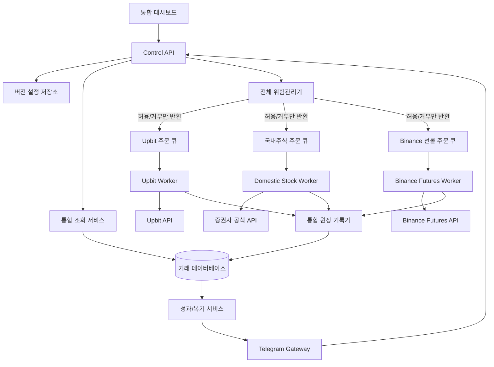

# 멀티자산 연동 상세설계서: Upbit · 국내주식 · Binance 선물

작성일: 2026-07-22  
개정일: 2026-09-07, Binance 선물 연결 설계 추가  
상태: 상세설계 초안, 구현 전 검토 단계

전체 구축 진입점: [통합 구축·서버 이전·뉴런형 대시보드 마스터 설계](MASTER_BUILD_AND_MIGRATION_PLAN.md). 배포·이전·기본 화면 구성은 해당 문서가 우선한다.

2026-09-07 추가 설계: [사이버펑크 대시보드·단주기 매매 구조](CYBERPUNK_REALTIME_DESIGN.md). GitHub UI 사례, 원본 매매 규칙과 단축 버전의 차이, 실시간 처리 목표, 화면 조작과 구축 순서를 정의한다.

## 1. 목적

현재 Upbit 자동매매 시스템을 유지하면서 국내 증권사 계좌와 Binance 선물계좌를 추가 연결한다. 서버, 대시보드, 통합 자산 조회, 알림, 감사 로그처럼 공통으로 사용할 수 있는 기능만 공유하고 인증, 전략 상태, 주문, 체결, 리스크와 장애 처리는 시장별로 독립 운영한다. Binance 상세 계약과 초기 범위는 31절을 따른다.

본 설계는 다음 목표를 갖는다.

- Upbit 장애가 국내주식 주문에 영향을 주지 않는다.
- 국내주식 장애가 암호화폐 매도 감시에 영향을 주지 않는다.
- 사용자는 한 대시보드에서 전체 자산을 확인할 수 있다.
- 시장별 운영 권한, 투자 성향, 전략과 킬 스위치를 따로 설정한다.
- 모든 주문은 중복 방지 키와 전략 버전을 가진다.
- 설정 변경은 저장 즉시 기존 포지션에 적용하지 않는다.
- 유튜브 투자 콘텐츠는 연구 프레임으로만 사용하고, 검증된 정형 데이터만 자동주문 근거로 사용한다.

## 2. 범위

### 포함

- 국내주식 계좌, 예수금, 잔고, 주문 가능 금액 조회
- 국내주식 시세, 주문, 체결, 미체결, 정정, 취소
- Upbit·국내주식·Binance 선물의 통합 KRW 자산 화면
- Binance 선물 잔고, 포지션, 일반·조건부 주문, 체결, 펀딩비 조회와 독립 주문 워커
- 국내주식 전용 전략 세 가지
- 시장별 독립 리스크 관리
- 통합 성과분석과 Telegram 알림
- 설정 초안, 검토, 활성화, 롤백
- 모의투자, 승인형 실거래, 제한 자동매매

### 제외

- 증권사 공식 API가 없는 계좌의 비공식 화면 자동화
- 유튜브 영상에서 종목명을 추출해 즉시 주문하는 기능
- 출처와 시각을 확인할 수 없는 뉴스 기반 자동주문
- 국내주식 신용, 미수, 공매도 및 국내 파생상품의 초기 버전 지원
- Binance COIN-M, Portfolio Margin, 옵션의 초기 주문 지원
- 여러 증권사 계좌 간 자동 자금이체

## 3. 핵심 설계 원칙

1. 화면은 통합하고 주문 권한은 분리한다.
2. 공통 위험관리기는 주문을 거부할 수 있지만 주문을 직접 전송하지 않는다.
3. 증권사 인증정보는 해당 주문 워커만 읽는다.
4. 전략 판단과 주문 실행 사이에 독립적인 리스크 검증 단계를 둔다.
5. 주문 요청은 한 번만 처리할 수 있는 `intent_id`를 가진다.
6. 체결 완료 여부는 주문 상태 문자열이 아니라 실제 체결수량과 체결내역으로 판단한다.
7. 기존 포지션은 진입 당시 전략 버전과 청산 규칙을 유지한다.
8. 모든 수익률은 수수료와 세금을 구분해 계산한다.
9. 원본 거래 기록은 수정하지 않고 정정 이벤트를 추가한다.
10. 화면에는 데이터 기준시각과 지연 상태를 항상 표시한다.

## 4. 논리 구조



## 5. 같은 서버에서 공유할 것과 분리할 것

### 공통 사용

| 구성요소 | 역할 | 주문 권한 |
| --- | --- | --- |
| 통합 대시보드 | 화면, 설정 초안, 조회 | 없음 |
| Control API | 명령 검증과 라우팅 | 없음 |
| 통합 조회 서비스 | 자산과 손익 통합 | 없음 |
| 원장 기록기 | 주문·체결 이벤트 기록 | 없음 |
| 설정 저장소 | 버전별 설정 보관 | 없음 |
| Telegram Gateway | 알림과 승인 전달 | 없음 |
| 성과분석 서비스 | 수익률, 승률, 낙폭 분석 | 없음 |
| 전체 위험관리기 | 통합 한도 초과 주문 거부 | 거부만 가능 |

### 반드시 분리

| Upbit 영역 | 국내주식 영역 |
| --- | --- |
| Upbit 인증키 | 증권사 App Key, Secret, 계좌정보 |
| 암호화폐 API 제한기 | 증권사 API 제한기 |
| 24시간 스케줄러 | 국내 증시 거래일·장시간 스케줄러 |
| 암호화폐 전략 상태 | 국내주식 전략 상태 |
| Upbit 주문 실행기 | 증권사 주문 실행기 |
| 암호화폐 미체결 관리 | 주식 미체결·정정·취소 관리 |
| Upbit 킬 스위치 | 국내주식 킬 스위치 |
| 암호화폐 손익 계산 | 주식 수수료·세금·결제 손익 계산 |

## 6. 권장 프로세스 구성

한 서버에서 다음 프로세스를 독립 실행한다.

```text
dashboard-service
control-api
ledger-writer
notification-gateway
upbit-worker
stock-worker-{broker}
binance-futures-worker-{account}
performance-worker
watchdog
```

각 워커는 개별 재시작할 수 있어야 한다. `upbit-worker` 재시작이 `stock-worker` 프로세스를 종료해서는 안 된다. 공통 프로세스 장애 시 주문 워커는 신규 진입을 중단하고 기존 포지션의 보호 매도만 허용하는 `degraded` 상태로 전환한다.

## 7. 권장 프로젝트 구조

```text
multi-asset-trader/
├─ apps/
│  └─ dashboard/
├─ services/
│  ├─ control_api/
│  ├─ ledger_writer/
│  ├─ notification/
│  └─ performance/
├─ workers/
│  ├─ upbit/
│  ├─ domestic_stock/
│  └─ binance_futures/
├─ adapters/
│  ├─ upbit/
│  ├─ kis/
│  ├─ kiwoom/
│  ├─ lssec/
│  └─ binance_futures/
├─ strategies/
│  ├─ crypto/
│  └─ domestic_stock/
├─ core/
│  ├─ domain/
│  ├─ risk/
│  ├─ orders/
│  └─ events/
├─ config/
├─ migrations/
├─ tests/
└─ docs/
```

현재 프로젝트는 우선 `workers/upbit`의 기준 구현으로 보존한다. 국내주식 연결이 검증되기 전까지 기존 Upbit 실행경로를 크게 이동하지 않는다.

## 8. 증권사 어댑터 계약

첫 증권사가 정해지지 않았으므로 주문 엔진은 아래 공통 인터페이스만 의존한다.

```python
class BrokerAdapter(Protocol):
    def health_check(self) -> HealthStatus: ...
    def refresh_token(self) -> TokenStatus: ...
    def get_accounts(self) -> list[BrokerAccount]: ...
    def get_cash(self, account_id: str) -> CashBalance: ...
    def get_positions(self, account_id: str) -> list[StockPosition]: ...
    def get_quote(self, symbol: str) -> StockQuote: ...
    def get_candles(self, symbol: str, interval: str, count: int) -> DataFrame: ...
    def place_order(self, intent: OrderIntent) -> BrokerOrder: ...
    def get_order(self, broker_order_id: str) -> BrokerOrder: ...
    def cancel_order(self, broker_order_id: str, quantity: int | None = None) -> BrokerOrder: ...
    def replace_order(self, broker_order_id: str, price: float, quantity: int) -> BrokerOrder: ...
    def get_trading_calendar(self, start: date, end: date) -> list[TradingDay]: ...
```

증권사별 응답은 어댑터 안에서 공통 모델로 변환한다. 전략과 대시보드는 증권사 원본 필드명을 직접 사용하지 않는다.

## 9. 공통 도메인 모델

### AccountSnapshot

- `market`: `CRYPTO`(기존 Upbit 현물), `KR_STOCK`, `CRYPTO_FUTURES`
- `product_type`: 현물, 주식, 선형 무기한 등 상품 유형
- `environment`: `LIVE` 또는 `DEMO`; 통합 실자산에서 DEMO 제외
- `broker`
- `account_alias`
- `currency`
- `cash_available`
- `cash_settled`
- `cash_unsettled`
- `total_equity`
- `as_of`
- `freshness_status`

### Position

- `position_id`
- `market`
- `broker`
- `account_id_hash`
- `symbol`
- `quantity_available`
- `quantity_locked`
- `avg_entry_price`
- `current_price`
- `market_value`
- `unrealized_pnl`
- `strategy_id`
- `strategy_version`
- `entry_time`
- `management_scope`: `AUTO`, `MANUAL`, `LEGACY`

### OrderIntent

- `intent_id`: 전역 유일값
- `market`
- `broker`
- `account_alias`
- `symbol`
- `side`
- `order_type`
- `quantity` 또는 `amount`
- `limit_price`
- `strategy_id`
- `strategy_version`
- `reason_codes`
- `risk_snapshot_id`
- `approval_id`
- `expires_at`

### Execution

- `execution_id`
- `intent_id`
- `broker_order_id`
- `fill_id`
- `fill_price`
- `fill_quantity`
- `fee`
- `tax`
- `executed_at`

## 10. 주문 상태 모델

```text
DRAFT
→ VALIDATED
→ APPROVAL_PENDING 또는 APPROVED
→ QUEUED
→ SUBMITTED
→ PARTIALLY_FILLED
→ FILLED

SUBMITTED/PARTIALLY_FILLED
→ CANCEL_REQUESTED
→ CANCELLED

모든 단계
→ REJECTED 또는 EXPIRED
```

`cancelled` 상태라도 체결수량이 0보다 크면 해당 체결은 손익 원장에 반영한다. 주문 완료 여부와 거래 성공 여부를 같은 값으로 판단하지 않는다.

## 11. 설정 변경 생명주기

설정은 다음 상태를 가진다.

```text
DRAFT → REVIEWED → SCHEDULED → ACTIVE → SUPERSEDED
                      └────────→ CANCELLED
```

화면에는 반드시 다음을 보여준다.

- 현재 활성 버전
- 변경 전후 값
- 영향을 받는 시장과 전략
- 예상 주문금액 변화
- 기존 포지션 적용 여부
- 활성화 시각
- 되돌릴 버전

기본값은 `신규 진입부터 적용`이다. 손절, 익절, 추적매도와 시간 종료 규칙을 기존 포지션에 적용하려면 별도 확인 문구를 입력해야 한다.

## 12. 국내주식 거래시간 정책

시장상태를 다음처럼 구분한다.

- `CLOSED`: 휴장 또는 장 종료
- `PRE_OPEN`: 장 시작 전
- `OPEN_AUCTION`: 시초가 동시호가
- `REGULAR`: 정규장
- `CLOSING_AUCTION`: 종가 동시호가
- `AFTER_HOURS`: 시간외
- `HALTED`: 거래정지 또는 시스템 차단

초기 자동매매는 `REGULAR`에서만 신규 진입한다. 장 시작 직후와 마감 직전 제한시간은 설정으로 둔다. 미체결 주문은 장 종료 정책에 따라 취소하거나 다음 거래일로 이월하지 않고 만료시키는 것을 기본값으로 한다.

## 13. 종목 유니버스 필터

다음 종목은 기본 제외한다.

- 거래정지, 관리, 투자주의·경고·위험
- 상장폐지 절차 또는 정리매매
- 거래대금과 호가잔량이 기준 미달인 종목
- 신규상장 후 데이터 축적기간이 부족한 종목
- 가격제한폭 근처에서 주문 위험이 큰 종목
- ETF, ETN, 스팩, 우선주 등 사용자가 허용하지 않은 유형
- 재무·가격 데이터가 오래되거나 서로 일치하지 않는 종목

제외 사유와 해제 조건을 종목별로 기록한다.

## 14. 투자 스타일 모델

`보수형`, `균형형`, `적극형`은 추천 품질을 낮추는 기능이 아니다. 동일한 진입 품질을 유지하면서 위험예산과 운영 권한만 변경한다.

| 항목 | 보수형 | 균형형 | 적극형 |
| --- | --- | --- | --- |
| 전략 점수 하한 | 동일 | 동일 | 동일 |
| 주문 위험예산 | 낮음 | 기본 | 높음 |
| 최대 포지션 | 적음 | 중간 | 많음 |
| 손실 후 대기 | 김 | 기본 | 짧음 |
| 일일 손실한도 | 낮음 | 중간 | 높음 |
| 자동주문 권한 | 승인 중심 | 혼합 | 검증 전략 자동 |
| 데이터 지연 허용 | 없음 | 없음 | 없음 |

주문금액은 고정 금액만 사용하지 않고 아래 값 중 가장 작은 금액으로 결정한다.

```text
전략 기본금액
계좌별 잔여 위험예산
종목별 최대금액
손절거리 기준 위험금액 / 손절률
사용가능 예수금 - 현금보유 하한
```

## 15. 전략 A: 퀀트형

내부 ID: `KR_QUANT_MULTIFACTOR`  
참고 스타일: 공개된 퀀트·자산배분·모멘텀 투자 콘텐츠  
권장 권한: 모의운영 후 제한 자동

### 데이터

- 일봉 수정주가
- 시가총액과 거래대금
- PER, PBR, PSR
- ROE, 영업이익률, 영업현금흐름
- 부채비율
- 3개월, 6개월, 12개월 모멘텀
- 변동성, 최대낙폭

### 점수 초안

| 영역 | 배점 | 예시 |
| --- | ---: | --- |
| 가치 | 30 | PER·PBR·PSR의 유니버스 내 백분위 |
| 품질 | 25 | ROE·현금흐름·수익성·부채 |
| 모멘텀 | 30 | 3·6·12개월 수익률과 신고가 거리 |
| 위험 | 15 | 변동성·낙폭·유동성 |

각 지표는 극단값을 제한하고 업종 중립 순위를 별도로 검토한다. 데이터 누락을 0점으로 단순 처리하지 않고 해당 종목을 평가 제외한다.

### 진입

- 유니버스 필터 통과
- 종합점수 하한 통과
- 시장 절대 모멘텀 필터 통과
- 목표 포트폴리오 상위 N개 포함
- 예상 거래비용을 반영해 교체 이익이 비용보다 큼

### 청산

- 정기 리밸런싱에서 순위 이탈
- 데이터 품질 이상
- 거래정지·경고 등 유니버스 제외
- 계좌 또는 시장 위험한도 도달

### 주기

- 점수 계산: 일 1회
- 리밸런싱: 월 1회 기본
- 긴급 위험점검: 장중

## 16. 전략 B: 주도주형

내부 ID: `KR_LEADERSHIP_CYCLE`  
참고 스타일: 장세·주도업종·기업가치 중심 공개 콘텐츠  
권장 권한: 추천 또는 승인형

### 1단계: 시장 장세

- KOSPI와 KOSDAQ의 장기 이동평균 위치
- 상승 종목 수 대비 하락 종목 수
- 시장 전체 거래대금
- 변동성 확대 여부
- 외국인·기관 수급 데이터가 신뢰 가능할 경우 보조 사용

### 2단계: 주도업종

- 업종 20일·60일 상대강도
- 업종 거래대금 증가율
- 업종 내 신고가 종목 비율
- 실적 전망 상향 종목 비율

### 3단계: 종목

- 매출과 영업이익 개선
- 업종 내 상대강도 상위
- 거래량이 동반된 돌파 또는 눌림목 반등
- 손절가격까지 예상손실이 계좌 위험예산 이내

### 진입과 청산

- 상승장: 주도업종 상위 종목의 눌림목 또는 돌파
- 중립장: 추천만 생성하고 승인 요구
- 약세장: 신규 진입 중단
- 업종 상대강도 하락, 실적 전망 하향, 투자 논리 훼손 시 청산 검토

실적 전망 데이터가 없으면 완전 자동주문을 허용하지 않는다. 단순 기사 제목이나 영상 발언은 `research_note`로만 저장한다.

## 17. 전략 C: 삼박자형

내부 ID: `KR_VALUE_PRICE_CATALYST`  
참고 스타일: 가치·가격·정보를 함께 보는 공개 콘텐츠  
권장 권한: 승인형 스윙

### 가치 40점

- 매출 성장
- 영업이익 성장
- ROE와 영업현금흐름
- 부채와 유상증자 위험
- 업종 대비 밸류에이션

### 가격 35점

- 20일·60일·120일 이동평균 배열
- 거래량 증가
- 52주 신고가 거리
- 시장·업종 대비 상대강도
- 갭과 변동성 위험

### 재료 25점

초기 버전은 정형 공시만 사용한다.

- 잠정실적과 정기실적
- 공급계약과 수주
- 신규 시설투자
- 자사주·배당 등 주주환원
- 증자·전환사채·최대주주 변경 등 희석·지배구조 위험

### 진입

- 총점 하한 통과
- 가치·가격·재료 중 어느 한 영역도 최소점수 미달이 아님
- 공시 원문과 종목코드 일치
- 공시 시각이 주문 판단보다 이전임
- 거래량 돌파 또는 눌림목 반등 확인

### 청산

- 공시 재료 취소 또는 정정
- 실적 하향과 가치점수 급락
- 가격 추세 훼손
- 최대 보유기간 도달
- 공통 손절·계좌 위험한도 도달

## 18. 전략 충돌 처리

같은 종목을 여러 전략이 추천해도 주문은 하나만 만든다.

```text
동일 market + broker + account + environment + symbol + position_side + action + 활성 주문 존재
→ 새 주문 생성 금지
→ 근거만 기존 OrderIntent에 추가
```

전략별 목표금액이 다르면 가장 큰 금액을 합산하지 않는다. 계좌 위험관리기가 허용한 단일 목표금액을 사용하고 `strategy_contributors`에 참여 전략을 기록한다. 반대 신호가 동시에 발생하면 신규 주문을 보류하고 사용자 확인 대상으로 분류한다.

## 19. 위험관리 계층

### 전체 계정

- 전체 자산 일일 손실한도
- 시장별 최대 자금 배분
- 전체 미체결 주문금액
- 동일 산업·고변동 자산의 집중도
- 데이터 지연 또는 원장 불일치 시 신규주문 차단

### 국내주식 계좌

- 예수금 하한
- 최대 포지션 수
- 종목별 최대 평가금액
- 일일 신규진입 수
- 연속 손실 후 대기
- 장 시작·마감 제한

### 전략

- 전략별 일일 손실
- 전략별 동시 포지션
- 전략별 최대 회전율
- 최근 성과 악화 시 `SHADOW` 강등

### 주문

- 호가단위 검증
- 가격제한폭 검증
- 주문가능수량 재조회
- 중복 `intent_id` 검증
- API 응답 불명확 시 재주문하지 않고 주문조회 먼저 수행

## 20. 보안 설계

### 인증정보

- 기존 Upbit `.env`는 유지한다.
- 증권사별 비밀정보는 별도 파일 또는 Secret Manager에 저장한다.
- 대시보드 프로세스는 주문용 비밀정보를 읽지 않는다.
- 계좌번호는 화면과 로그에서 마스킹한다.
- 토큰과 키는 Telegram으로 전송하지 않는다.
- 비밀정보의 생성, 사용, 교체, 폐기 시각을 감사한다.

### 네트워크

- 대시보드는 기본적으로 `127.0.0.1`에만 바인딩한다.
- 원격 접속은 VPN 또는 TLS와 MFA를 적용한 프록시를 사용한다.
- 데이터베이스와 내부 큐는 외부 인터넷에 노출하지 않는다.
- 증권사에서 IP 제한을 제공하면 주문 워커 서버 IP만 허용한다.

### 권한

- `dashboard`: 조회와 설정 초안
- `operator`: 일시정지와 승인
- `risk_admin`: 위험한도 활성화
- `order_worker`: 해당 시장 주문만 가능
- `auditor`: 원장과 설정 이력 조회

## 21. Telegram 설계

### 조회

- `/status all`
- `/status crypto`
- `/status stock`
- `/portfolio stock`
- `/recommend stock`
- `/why stock 005930`

### 제어

- `/pause crypto`
- `/pause stock`
- `/resume stock`
- `/kill stock`
- `/approve {approval_id}`
- `/reject {approval_id} 사유`

Telegram 메시지의 종목명이나 금액만으로 주문하지 않는다. 서버가 발급한 단기 `approval_id`, 허용된 채팅 ID, 만료시간과 설정 버전을 함께 검증한다.

## 22. 대시보드 정보구조

### 공통 사이드바

1. 통합 자산
2. 암호화폐
3. 국내주식
4. 통합 전략
5. 주문·체결
6. 위험관리
7. 연결 설정
8. Telegram
9. 성과·복기
10. 쉬운말 풀이
11. 설계·감사

Binance 연결 시 `암호화폐` 메뉴는 `Upbit 현물`로 명확히 표시하고, 바로 아래에 독립 `Binance 선물` 메뉴를 추가한다. 상세 탭은 31절을 따른다.

### 통합 자산

- 전체 KRW 환산 자산
- 시장별 자산과 현금
- 실현·미실현 손익
- 데이터 기준시각
- 시장별 연결상태
- 자산 비중과 손익 기여도

### 국내주식 하위 탭

- 계좌 요약
- 보유종목
- 관심종목
- 전략 추천
- 주문·미체결
- 체결·손익
- 국내주식 설정
- 증권사 연결

### 전략 추천 화면

- 전략별 ON/OFF
- `분석 전용`, `모의`, `승인형`, `제한 자동` 권한
- 추천 종목과 세부 점수
- 사용 데이터 기준시각
- 매수 사유와 반대 근거
- 예상 손절가격과 최대 예상손실
- 실제 주문 버튼이 아니라 승인 요청 생성 버튼

## 23. 데이터베이스 초안

핵심 테이블:

- `accounts`
- `account_snapshots`
- `instruments`
- `quotes`
- `positions`
- `strategy_definitions`
- `strategy_versions`
- `signals`
- `recommendations`
- `order_intents`
- `broker_orders`
- `executions`
- `fees_and_taxes`
- `risk_snapshots`
- `config_versions`
- `approval_requests`
- `control_commands`
- `audit_events`
- `daily_equity_snapshots`

원본 주문·체결 데이터는 JSON 컬럼에도 함께 보관하되, 비밀정보와 전체 계좌번호는 저장하지 않는다.

## 24. 성과 측정

시장, 계좌, 전략, 전략 버전별로 다음을 계산한다.

- 실현손익과 미실현손익
- 수수료·세금 전후 손익
- 승률
- 평균 이익과 평균 손실
- 손익비와 기대값
- 최대낙폭
- 회전율
- 평균 보유시간
- 주문 거부율
- 신호 대비 체결률
- 슬리피지
- 벤치마크 대비 성과

추천만 생성된 신호도 1일, 5일, 20일 후 결과를 기록해 선택 편향 없이 평가한다.

## 25. 장애 정책

| 장애 | 신규 진입 | 보호 매도 | 화면 |
| --- | --- | --- | --- |
| 시세 지연 | 차단 | 최신 호가 확인 후 제한 | 지연 표시 |
| 인증 만료 | 차단 | 토큰 갱신 후 수행 | 인증 오류 |
| 주문 응답 불명확 | 재주문 금지 | 주문조회 우선 | 확인 중 |
| 원장 저장 실패 | 차단 | 수동 확인 경보 | 심각 경고 |
| Telegram 장애 | 자동권한만 유지 | 유지 | 알림 장애 |
| 대시보드 장애 | 워커 정책 유지 | 유지 | 접속 불가 |
| 공통 DB 장애 | 차단 | 제한 모드 | 데이터 불명확 |

## 26. 테스트 전략

### 단위 테스트

- 증권사 응답 공통 모델 변환
- 호가단위와 주문수량 검증
- 전략 점수
- 위험한도
- 주문 상태 전이
- 설정 버전 적용 범위

### 계약 테스트

- 모의투자 인증
- 잔고·예수금 일치
- 주문·조회·취소
- 부분체결
- 토큰 만료와 재발급
- API 호출 제한

### 시뮬레이션

- 과거 데이터 백테스트
- 거래비용·슬리피지 포함
- 생존편향 방지 종목 유니버스
- 장 시작 갭과 가격제한폭
- 거래정지와 데이터 누락

### 운영 검증

1. 읽기 전용 5거래일
2. 모의투자 최소 20거래일
3. 승인형 소액 주문
4. 제한 자동 한 전략
5. 성과와 장애 기준 통과 후 권한 확대

## 27. 구축 단계

### 0단계: 현재 시스템 안정화

- Upbit 실행경로 보존
- JSON 원장의 데이터 품질 점검
- 설정 즉시 적용 문제를 버전 적용 방식으로 변경

### 1단계: 공통 기반

- 공통 도메인 모델
- SQLite WAL 또는 PostgreSQL 원장
- 통합 조회와 설정 버전
- 시장별 독립 킬 스위치

### 2단계: 증권사 읽기 전용

- 인증과 토큰
- 계좌·예수금·보유종목
- 시세와 거래일
- 통합 자산 탭

### 3단계: 전략 연구

- 퀀트형
- 주도주형
- 삼박자형
- 추천 사후성과 기록

### 4단계: 모의주문

- 주문 상태 전이
- 미체결·취소·정정
- Telegram 승인번호
- 장애 복구

### 5단계: 승인형 실거래

- 소액
- 지정된 종목군
- 수동 승인
- 즉시 대사와 알림

### 6단계: 제한 자동

- 검증된 전략 한 개
- 별도 위험예산
- 자동 강등과 킬 스위치

## 28. 완료 기준

- 세 시장의 프로세스를 각각 재시작할 수 있다.
- 한 시장의 API 장애가 다른 시장 주문에 영향을 주지 않는다.
- 통합 자산과 각 원계좌 평가액의 차이가 허용 범위 안이다.
- 동일 `intent_id`가 두 번 주문되지 않는다.
- 부분체결과 취소 후 체결을 정확히 기록한다.
- 설정 변경 전후와 활성화 시각을 확인할 수 있다.
- 기존 포지션의 전략 버전이 보존된다.
- 모든 주문의 전략, 사유, 위험검증, 승인, 체결을 추적할 수 있다.
- 비밀정보가 화면, 로그, Telegram에 노출되지 않는다.
- 모의투자와 승인형 단계 없이 완전 자동 권한을 켤 수 없다.

## 29. 구현 전 결정사항

1. 첫 연결 증권사
2. 계좌 유형: 일반, ISA, 연금 등
3. 모의투자 사용 가능 여부
4. 국내주식 데이터 제공 범위
5. 재무·컨센서스 데이터 공급원
6. 국내주식 초기 투자 성향
7. 주식 계좌별 자동매매 허용 금액
8. 장 시작·마감 제한시간
9. 원격 대시보드 필요 여부
10. SQLite 유지 또는 PostgreSQL 도입

## 30. 참고

- 한국투자증권 Open API: https://apiportal.koreainvestment.com/apiservice-summary
- 키움 REST API: https://openapi.kiwoom.com/intro/serviceInfo
- LS증권 Open API: https://openapi.ls-sec.co.kr/about-openapi
- OWASP Secrets Management: https://cheatsheetseries.owasp.org/cheatsheets/Secrets_Management_Cheat_Sheet.html
- NIST Least Privilege: https://nvlpubs.nist.gov/nistpubs/SpecialPublications/800-171r3/NIST.SP.800-171r3.html

본 설계의 세 전략은 특정 인물의 매매를 복제하거나 수익을 보장하는 기능이 아니다. 공개된 투자 철학을 시스템 검증이 가능한 내부 전략으로 재구성한 연구 모델이다.

## 31. Binance 선물 연결 상세설계

### 31.1 범위와 계좌 확인

사용자 요청에 따라 Binance 선물을 세 번째 독립 거래 영역으로 추가한다. 이 개정은 연결 설계이며 실제 API 연결 또는 주문 활성화를 의미하지 않는다.

- 초기 구현안: USDⓈ-M 중 USDT 증거금 암호화폐 무기한 계약.
- 실제 계좌의 상품 유형, API 사용 가능 여부, 포지션 모드, 증거금 모드, 담보 자산을 먼저 조회한다.
- COIN-M, 다중자산 담보, Portfolio Margin 등 미지원 구성이면 이유를 표시하고 주문 활성화를 막는다. 지원 범위를 자동 전환하지 않는다.
- 초기 운영안은 단방향·격리 방식이다. 기존 계좌 설정을 연결 과정에서 자동 변경하지 않는다.
- 선물 권한과 위험예산은 계좌별 별도 설정이다. 기존 Upbit 자동매매 권한을 복사하지 않는다.
- 테스트 환경과 실계좌는 키, 주소, 큐, 원장 범위를 분리한다.

### 31.2 공유와 격리

대시보드, Control API, 알림 전달, 공통 이벤트 형식과 성과 조회를 공유한다. 선물 워커는 인증키, API 호출 제한, 시계 동기화, 사용자 스트림, 전략 상태, 주문 큐, 보호주문 관리와 재시작을 독립 소유한다.

같은 서버의 프로세스 분리는 서버 전원·네트워크 장애까지 분리하지는 못한다. 거래소에 등록된 보호주문을 대사하고, 공통 서비스 복구 후 신규 진입보다 실제 포지션 확인을 먼저 한다. 로컬 데이터의 신뢰성이 없으면 임의 수량으로 청산하지 않는다.

### 31.3 선물 어댑터

현물·주식의 `매수/매도` 인터페이스를 그대로 재사용하지 않고 다음 계약을 추가한다.

| 계약 | 역할 |
| --- | --- |
| get_capabilities | 지원 상품·계좌 모드·주문 기능 확인 |
| get_account_configuration | 실제 포지션 모드·담보 구성 조회 |
| get_contracts | 거래 상태·증거금 자산·수량/가격 단위·최소 주문 조건 조회 |
| get_futures_account | 지갑잔고·미실현손익·순자산·사용가능 증거금 조회 |
| get_futures_positions | 방향·수량·진입가·마크가격·청산가격·증거금 조회 |
| submit_entry / submit_reduction | 신규 진입과 포지션 축소를 의미적으로 분리 |
| place_protection / reconcile_protection | 손절·익절 조건부 주문 등록과 실제 유효성 확인 |
| reconcile_orders_and_fills | 일반 주문·조건부 주문·체결 동시 대사 |
| get_income_events | 펀딩비·수수료·실현손익·이체 등 수입 이벤트 조회 |
| stream_account_events | 실시간 이벤트 수신, 재접속 후 REST 재대사 |

일반 주문과 Algo 조건부 주문은 각 API와 식별자를 구분해 저장한다. 구현 시 공식 API 스키마와 계약 테스트로 지원 필드를 확정한다.

### 31.4 데이터와 자산 계산

금액·가격·수량은 Decimal 또는 동등한 고정 정밀도로 계산한다.

- FuturesAccount: `wallet_balance`, `unrealized_pnl`, `equity`, `available_margin`, `initial_margin`, `maintenance_margin`, `margin_asset`, `account_mode`, `as_of`.
- FuturesPosition: 공통 Position에 `position_side`, `position_mode`, `margin_type`, `leverage`, `signed_quantity`, `mark_price`, `liquidation_price`, `notional`, `isolated_margin`, `protection_status` 추가.
- FuturesOrderIntent: `action=OPEN/INCREASE/REDUCE/CLOSE`, `position_side`, `quantity`, `trigger_price`, `trigger_basis`, `client_order_id`, `client_algo_id` 추가. 주문 방향과 포지션 방향을 구분한다.
- FundingEvent: 거래소 이벤트 ID, 계좌, 종목, 정산 자산, 부호 있는 금액, 발생 시각, 원본 유형을 저장한다.
- 환산값: `fx_rate`, `fx_source`, `fx_as_of`, `valuation_currency`를 저장한다.

초기 단일 USDT 담보 모델:

```text
선물 순자산 = 지갑잔고 + 미실현손익
선물 KRW 평가액 = 선물 순자산 × USDT/KRW 평가환율
통합 자산 = Upbit 순자산 + 국내주식 순자산 + 선물 KRW 평가액
계약 규모 = |수량 × 마크가격|  (자산 합계에 더하지 않음)
```

지갑잔고에 이미 반영된 실현손익과 펀딩비를 순자산에 다시 더하지 않는다. 계좌별 담보를 포지션마다 중복 합산하지 않는다. USDT를 USD와 항상 같다고 가정하지 않고 평가환율 출처와 지연을 표시한다. 내부 이체는 자산 이동으로 연결하며 수익에서 제외한다.

계좌 수익률, 포지션 증거금 대비 수익률, 가격 변동률은 각각 이름과 분모를 표시한다. 현물 BTC와 선물 BTC 롱·숏의 총노출과 순노출을 함께 집계하되, 상쇄된 순노출을 이유로 각 거래소의 증거금 검사를 생략하지 않는다.

### 31.5 주문과 보호주문 흐름

```text
추천 → 권한 확인 → 실제 계좌 모드·한도·시세 확인
→ 진입 요청 → 접수/체결 대사 → 실제 체결량에 보호주문 등록
→ 보호주문 유효성 확인 → 포지션 감시 → 축소/청산 → 잔여 주문 정리
```

- 롱 청산은 매도, 숏 청산은 매수다. 화면에는 `매수/매도`와 함께 `롱 진입/숏 청산` 같은 목적을 표시한다.
- 단방향 축소는 지원되는 reduce-only 의미를 적용한다. Hedge Mode는 `positionSide`와 해당 API의 허용 조합으로 처리한다. 모든 모드에 `reduceOnly`를 일괄 전송하지 않는다.
- 부분체결마다 실제 노출과 보호 수량을 맞춘다. 취소 요청 중 추가 체결도 반영한다.
- `PROTECTION_PENDING`, `PROTECTED`, `PROTECTION_FAILED`는 주문 상태와 별도 포지션 보호 상태다.
- 보호주문 등록 실패 시 추가 진입을 차단한다. 설정된 복구 기한 내 재조회·재등록하고, 실패가 지속되면 미리 설정한 축소/청산 정책을 실제 잔량 기준으로 수행한다.
- 요청 시간초과는 실패 확정이 아니다. `SUBMISSION_UNKNOWN`으로 기록하고 client ID로 조회한 뒤 재시도 여부를 결정한다. 취소·청산도 같은 원칙을 적용한다.
- 재시작 시 포지션·일반 주문·조건부 주문·체결을 복원한 후 진입을 허용한다.
- 수동 포지션은 `MANUAL`로 분류한다. 사용자가 관리 대상으로 지정한 범위에만 자동 청산 규칙을 적용한다.

### 31.6 위험관리와 설정

투자 성향과 주문 승인 수준은 독립 설정이다. 적극형을 선택했다는 이유로 레버리지나 자동주문 권한을 올리지 않는다. 아래 수치는 실운영 확정값이 아닌 모의 검증용 초안이다.

| 대시보드 설정 | 입력 방식 | 동작 |
| --- | --- | --- |
| 운영 수준 | 단계 선택 | 분석 전용 / 진입마다 승인 / 설정 범위 자동 |
| 롱·숏 허용 | 각각 체크박스 | 허용 방향만 신규 추천·주문 |
| 종목·그룹 | 검색·체크박스 | 허용 목록과 제외 목록 저장, 제외 우선 |
| 레버리지 상한 | 정수 입력 | 초기 검증안 2배, 실제 종목 설정과 재확인 |
| 주문당 손실예산 | %·금액 입력 | 초기 검증안 선물 순자산의 0.25% |
| 일일 손실한도 | %·금액 입력 | 초기 검증안 1%, 입출금 제외 일초 대비 손익으로 판단 |
| 최대 계약 규모 | USDT 입력 | 레버리지 적용 후 노출 총액 제한 |
| 최대 증거금 사용률 | % 입력 | 미체결의 예약 증거금도 포함 |
| 최대 동시 포지션 | 정수 입력 | 계좌·종목·방향별 집계 기준 표시 |
| 청산가격 여유 | % 입력 | 마크가격 대비 거리로 검사, 청산가 미확정도 표시 |
| 펀딩비 한도 | 비율·금액 입력 | 예상 보유기간의 지불 비용 검토 |
| 손절·익절 | 가격 또는 % | 방향·마크가격 기준 등 실제 트리거 조건 표시 |

단순 선형 계약의 초기 수량 계산은 `손실예산 / (진입가와 손절가의 거리 + 단위당 예상 비용)`을 출발점으로 하고, 계약 한도·증거금·거래소 필터로 추가 제한한다. 손절 예상손실은 급변·슬리피지로 초과될 수 있으므로 보장값으로 표시하지 않는다. 청산가격은 단순 레버리지 역수로 계산하지 않고 거래소 조회값과 증거금 구간을 사용한다.

계좌 모드는 전체 종목에 영향을 줄 수 있으므로 일반 전략 저장 동작과 분리한다. 변경 영향과 현재 포지션·미체결 조건을 확인하고 거래소 허용 여부를 검증한다.

### 31.7 추천과 전략

초기 연구 후보는 추세추종 롱·숏과 변동성 돌파다. Upbit 매수 점수나 국내주식 재무 점수를 선물 전략에 그대로 적용하지 않는다.

추천에는 종목, 방향, 진입 조건, 무효화 조건, 손절·익절, 계약 규모, 예상 증거금, 비용 추정, 데이터 시각과 반대 근거를 포함한다. 승률은 거래비용·펀딩비를 포함한 검증 구간과 표본 수를 함께 표시하고 표본이 없으면 `미검증`으로 표시한다.

거래 가능한 계약 목록에서 유동성·스프레드·데이터 길이·거래 상태를 검사한다. 사용자의 종목 제외와 그룹 제한은 추천·주문 양쪽에 적용한다. 펀딩 주기는 고정 8시간으로 가정하지 않고 해당 계약의 정보를 조회한다.

### 31.8 대시보드와 Telegram

선물 화면 상단에는 계좌 별칭, 실계좌/테스트, 동기화 시각, 운영 단계, 신규 진입 상태와 실제 모드를 고정 표시한다.

| 선물 탭 | 내용과 사용자 조작 |
| --- | --- |
| 계좌 현황 | 순자산 그래프, USDT/KRW 전환, 지갑·증거금·계약 규모 구분 |
| 포지션 | 전체 보유계약, 롱/숏, 진입가·마크가·청산가, 관리 대상 선택, 축소·청산 요청 |
| 추천·사유 | 방향별 후보, 근거 펼치기, 승인·거부 |
| 주문·보호 | 일반/조건부 주문 분리, 체결량, 보호 실패, 개별 취소 요청 |
| 성과·펀딩 | 실현/미실현, 수수료, 펀딩비, 입출금, 기간·전략 필터 |
| 종목·그룹 | 계약 검색, 전체 선택, 제외, 그룹 생성·편집 |
| 설정 | 운영 단계, 위험 한도, 방향, 전략, 버전 저장·적용 |
| 알림 | 유형 체크, 우선순위, 요약 주기, 동일 이벤트 묶음, 미리보기 |
| 설명·용어 | 롱·숏·증거금·레버리지·마크가격·청산·펀딩비 설명 |

상태 색상과 문구를 함께 사용한다. 정상은 녹색, 확인 대기는 황색, 오류·위험은 적색, 비활성은 회색으로 표시하고 선택·저장 버튼과 상태 배지를 구별한다.

Telegram 명령 설계 예시:

```text
/status futures                 선물 연결·운영 상태
/portfolio futures              전체 선물 포지션
/recommend futures              허용 종목 내 추천
/why futures ETHUSDT            추천 방향과 근거
/pause futures                  신규 진입 중지, 보호 감시는 유지
/resume futures                 기존 권한·한도 안에서 재개
/close futures POSITION_ID      정확한 포지션의 청산 요청 생성
/approve APPROVAL_ID            유효한 요청 승인
/reject APPROVAL_ID 사유        요청 거부
```

명령은 계좌·환경·포지션·설정 버전에 바인딩한다. 승인 대기 중 가격이 허용 범위를 벗어나면 재평가한다. 일시정지, 보호주문 취소, 전량 청산은 서로 다른 동작이다.

알림은 `보호 실패/청산 위험 → 주문 거부 → 체결 → 추천 → 정기 요약` 순으로 기본 설정한다. 심각 이벤트는 사건 최초 발생 및 상태 변화에 즉시 전송하고, 반복은 사건 ID별 제한 주기로 묶는다. 체결 이벤트도 중복 키로 한 번 기록하고 전송 대기열을 통해 재전송한다. 일반 알림의 재시도로 긴급 알림이 밀리지 않도록 큐를 분리한다.

### 31.9 보안·검증·구축 순서

Binance 키는 별도 비밀 저장소에서 해당 워커만 읽는다. 기존 Upbit `.env`를 유지하고 채팅에 키를 입력받지 않는다. 필요한 조회·선물 거래 권한만 사용하며 출금·자동 이체는 초기 범위에 포함하지 않는다.

원장에는 `futures_account_snapshots`, `futures_position_snapshots`, `protection_orders`, `income_events`, `fx_rates`를 추가한다. 모든 키와 조회 범위에 계좌·환경·거래소를 포함한다.

검증 시 다음을 확인한다.

1. 연결 모드와 실제 계좌 설정 불일치 시 주문 차단.
2. 롱·숏 부분청산 후 반대 포지션이 새로 열리지 않음.
3. 일반·조건부 주문 시간초과, 부분체결, 재접속에서 중복 주문 방지.
4. 보호주문 등록 실패와 외부 수동 취소 감지·복구.
5. 거래소 잔고·포지션·펀딩 내역과 내부 원장 일치.
6. 이체 및 환율 변화가 매매 수익으로 잘못 집계되지 않음.
7. 선물 워커 중지·재시작이 Upbit와 국내주식 워커에 영향을 주지 않음.
8. 실계좌와 테스트 데이터·명령 완전 분리.

구축 순서는 읽기 전용 연결 → 자산·포지션 대시보드 → 추천 모의검증 → 테스트 주문과 보호주문 → 계좌별 설정 범위 실거래다. 실제 연결 전 상품 유형과 초기 운영 단계·허용금액을 확정한다.

### 31.10 공식 API 확인 근거

2026-09-07 확인. API 변경에 대응하도록 구현 시 다시 계약을 검증한다.

- [Binance USDⓈ-M 주문·Algo 주문·포지션 모드 API](https://developers.binance.com/en/docs/catalog/core-trading-derivatives-trading-usd-s-m-futures/api/rest-api/trade)
- [Binance USDⓈ-M 계좌·잔고·수입 이력 API](https://developers.binance.com/en/docs/catalog/core-trading-derivatives-trading-usd-s-m-futures/api/rest-api/account)
